# 双路 AD9226 高速ADC模块使用手册

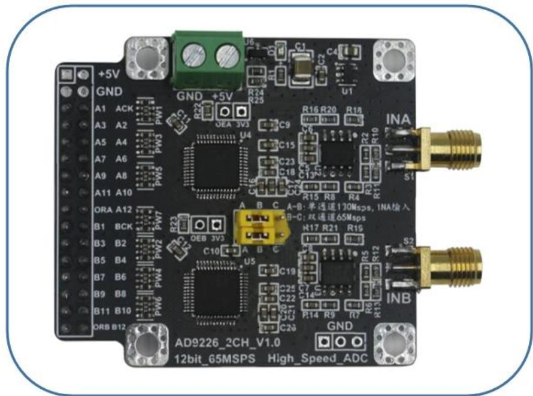

满怀激情，扬帆起航

## 一、前言

本手册旨在为我们的产品提供全面的操作说明。本手册的目标是帮助用户充分了解和使用我们的产品，提供必要的技术支持和指导。由于模块性能参数较多，若用户发现手册有错误之处，望指出，谢谢您的支持。

## 二 、概述

模块主芯片采用ADI公司的AD9226，其是一款单片、单电源、12位、65MSPS模数转换器，带有片上高性能采样保持放大器和电压基准。模块采用5V供电，内置两片 AD9226，可实现双路独立采集或合并单路采集，其输入阻抗50Ω，输入范围可达10Vpp（±5V），模拟带宽350MHz，保证了输入信号在65Msps 或130Msps 采样率下能够被精确的采集。模块可广泛的应用于传感器信号采集、高速信号采集等场景中。

## 三 、规格 (性能指标+结构尺寸)

模块性能指标，如下表所示。

<table><tr><td colspan="3">模块参数表</td></tr><tr><td>参数名称</td><td>参数值</td><td>备注</td></tr><tr><td>芯片型号</td><td>AD9226</td><td></td></tr><tr><td>模块类型</td><td>数模转换器</td><td>高速 ADC</td></tr><tr><td>供电电源</td><td>+5V</td><td>请勿过压供电</td></tr><tr><td>采样率</td><td>65Msps</td><td></td></tr><tr><td>ADC 分辨率</td><td>12 位</td><td></td></tr><tr><td>输入电压范围</td><td>±5V(10Vpp)</td><td></td></tr><tr><td>输入阻抗</td><td>50 Ω</td><td></td></tr><tr><td>模拟带宽</td><td>350MHz</td><td></td></tr><tr><td>通道数</td><td>双通道</td><td></td></tr></table>

淘宝地址：https://qzkydz.taobao.com

双路 AD9226 高速 ADC 模块使用手册

欢迎关注我们感谢您的支持与信任

<table><tr><td>工作模式</td><td>双路65Msps单路130Msps</td><td>短路帽连接A-B:单通道130Msps,INA输入;短路帽连接B-C:双通道65Msps</td></tr><tr><td>基准电压</td><td>内部2V</td><td></td></tr><tr><td>数据输出格式</td><td>直接码</td><td></td></tr><tr><td>控制电平信号</td><td>3.3V</td><td></td></tr><tr><td>例程语言</td><td>Verilog</td><td></td></tr><tr><td>例程平台</td><td>QuartusII 13.0</td><td></td></tr><tr><td>输出模式</td><td>并行数据</td><td></td></tr><tr><td>输入接口</td><td>SMA</td><td></td></tr><tr><td>输出接口</td><td>2.54间距母座</td><td></td></tr><tr><td>电源接口</td><td>2.54间距母座/端子</td><td>默认端子</td></tr><tr><td>模块保护</td><td>有</td><td>电源反接保护</td></tr><tr><td>模块应用</td><td>多种</td><td>高速ADC采集、数据采集</td></tr><tr><td>模块尺寸</td><td>5.5cm*5.0cm</td><td>长*宽</td></tr><tr><td colspan="3">注:性能指标中给出的参数,由于在不同条件下(环境、仪器)测得的结果存在一定的差异性属正常现象。</td></tr></table>

## 模块性能参数表

模块结构尺寸，如下表所示。

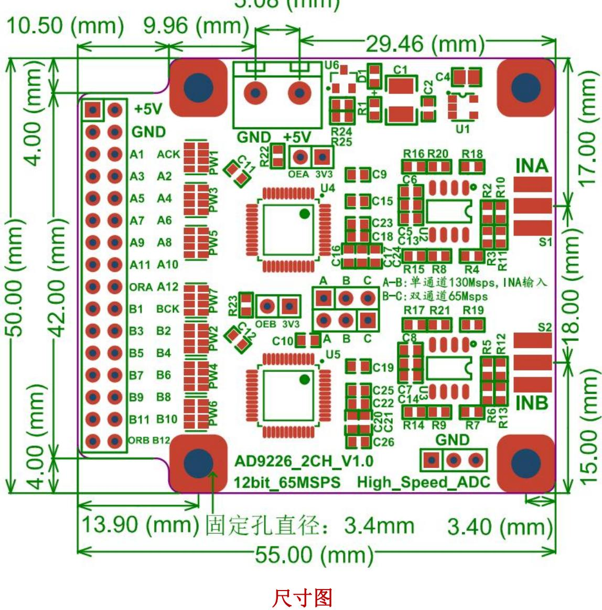

## 四 、操作指南 (接口说明+操作说明)

## 1. 接口说明：

模块使用前，用户需先仔细了解下各个信号接口的用途，以免因接口不熟悉，而使用不当，造成模块损坏！！！

这里需要注意，容易造成模块损坏的操作是电源反接和供电电压过大，在给模块上电的时候要先注意一下供电电源是否正确。

模块接口示意图如下所示：

淘宝地址：https://qzkydz.taobao.com

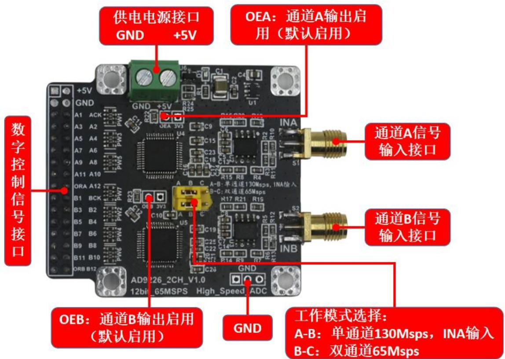

模块各个接口说明：

供电电源接口：+5：为供电电源的正电压输入接口；GND:为供电电源的输入地；

信号输入接口：IN：为信号的输入端口，输入阻抗50Ω；

数字控制信号接口：

ACK：为通道 A 的 AD9226 时钟。

A1：通道A数据输出位，最低位数据。

A2：通道A数据输出位，第2位数据。

A3：通道A数据输出位，第3位数据。

A4：通道A数据输出位，第4位数据。

A5：通道A数据输出位，第5位数据。

A6：通道A数据输出位，第6位数据。

A7：通道A数据输出位，第7位数据。

A8：通道A数据输出位，第8位数据。

A9：通道A数据输出位，第9位数据。

A10：通道A数据输出位，第10位数据。

淘宝地址：https://gzkydz.taobao.com

A11：通道A数据输出位，第11位数据。

A12：通道A数据输出位，最高位数据。

ORA：为通道 A的输入信号超量程范围标志。

BCK：为通道 B 的 AD9226 时钟。

B1：为通道B数据输出位，最低位数据。

B2：为通道B数据输出位，第 2位数据。

B3：为通道B数据输出位，第 3位数据。

B4：为通道B数据输出位，第 4位数据。

B5：为通道B数据输出位，第 5位数据。

B6：为通道B数据输出位，第 6位数据。

B7：为通道B数据输出位，第 7位数据。

B8：为通道B数据输出位，第 8位数据。

B9：为通道B数据输出位，第 9位数据。

B10：为通道B数据输出位，第 10 位数据。

B11：为通道B 数据输出位，第11位数据。

B12：为通道B数据输出位，最高位数据。

ORB：为通道B 的输入信号超量程范围标志。

通道 A 输出启用接口：OEA：默认启用。如果需要禁用，则要给OEA 一个高电平（3.3V电压）。

通道 B 输出启用接口：OEB：默认启用。如果需要禁用，则要给OEB 一个高电平（3.3V电压）。

工作模式选择接口：短路帽选择A-B 连接，为单通道130Msps，INA 输入。短路帽选择B-C 连接，为双通道 65Msps。

GND 接口：三孔2.54MM 间距的接地孔，仅仅为方便客户与模块共地。

## 2. 操作说明

淘宝地址：https://gzkydz.taobao.com

## 双路AD9226高速 ADC模块使用手册

## 欢迎关注我们感谢您的支持与信任

模块工作整体连接示意图如下所示：

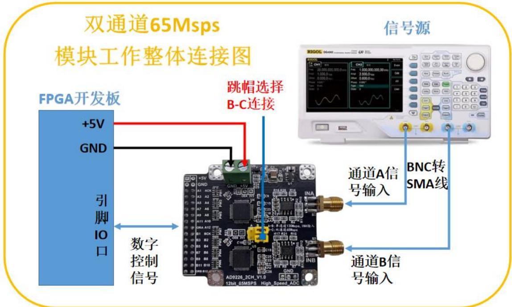<br>
双通道 65Msps 模式-信号源测量连接方式

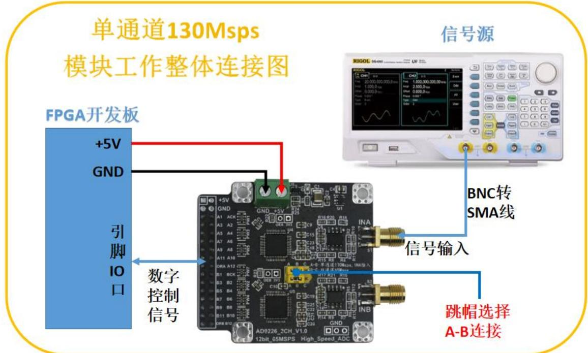<br>
单通道 130Msps 模式-信号源测量连接方式

<table><tr><td>To</td><td>Assignment Name</td><td>Value</td></tr><tr><td> $\rightarrow$  Adc_Clk_A</td><td>Location</td><td>PIN_N3</td></tr><tr><td>in  $\rightarrow$  Adc_In_A[0]</td><td>Location</td><td>PIN_P3</td></tr><tr><td>in  $\rightarrow$  Adc_In_A[1]</td><td>Location</td><td>PIN_L6</td></tr><tr><td>in  $\rightarrow$  Adc_In_A[2]</td><td>Location</td><td>PIN_L7</td></tr><tr><td>in  $\rightarrow$  Adc_In_A[3]</td><td>Location</td><td>PIN_K6</td></tr><tr><td>in  $\rightarrow$  Adc_In_A[4]</td><td>Location</td><td>PIN_N9</td></tr><tr><td>in  $\rightarrow$  Adc_In_A[5]</td><td>Location</td><td>PIN_M10</td></tr><tr><td>in  $\rightarrow$  Adc_In_A[6]</td><td>Location</td><td>PIN_M9</td></tr><tr><td>in  $\rightarrow$  Adc_In_A[7]</td><td>Location</td><td>PIN_B6</td></tr><tr><td>in  $\rightarrow$  Adc_In_A[8]</td><td>Location</td><td>PIN_A5</td></tr><tr><td>in  $\rightarrow$  Adc_In_A[9]</td><td>Location</td><td>PIN_A6</td></tr><tr><td>in  $\rightarrow$  Adc_In_A[10]</td><td>Location</td><td>PIN_B7</td></tr><tr><td>in  $\rightarrow$  Adc_In_A[11]</td><td>Location</td><td>PIN_B8</td></tr><tr><td>in  $\rightarrow$  Otr_A</td><td>Location</td><td>PIN_A7</td></tr><tr><td>out  $\rightarrow$  Adc_Clk_B</td><td>Location</td><td>PIN_A8</td></tr><tr><td>in  $\rightarrow$  Adc_In_B[0]</td><td>Location</td><td>PIN_E6</td></tr><tr><td>in  $\rightarrow$  Adc_In_B[1]</td><td>Location</td><td>PIN_C6</td></tr><tr><td>in  $\rightarrow$  Adc_In_B[2]</td><td>Location</td><td>PIN_D6</td></tr><tr><td>in  $\rightarrow$  Adc_In_B[3]</td><td>Location</td><td>PIN_E7</td></tr><tr><td>in  $\rightarrow$  Adc_In_B[4]</td><td>Location</td><td>PIN_F6</td></tr><tr><td>in  $\rightarrow$  Adc_In_B[5]</td><td>Location</td><td>PIN_L9</td></tr><tr><td>in  $\rightarrow$  Adc_In_B[6]</td><td>Location</td><td>PIN_F7</td></tr><tr><td>in  $\rightarrow$  Adc_In_B[7]</td><td>Location</td><td>PIN_K9</td></tr><tr><td>in  $\rightarrow$  Adc_In_B[8]</td><td>Location</td><td>PIN_F9</td></tr><tr><td>in  $\rightarrow$  Adc_In_B[9]</td><td>Location</td><td>PIN_N11</td></tr><tr><td>in  $\rightarrow$  Adc_In_B[10]</td><td>Location</td><td>PIN_F10</td></tr><tr><td>in  $\rightarrow$  Adc_In_B[11]</td><td>Location</td><td>PIN_C8</td></tr><tr><td>in  $\rightarrow$  Otr_B</td><td>Location</td><td>PIN_D11</td></tr><tr><td>in  $\rightarrow$  Ext_Rst_n</td><td>Location</td><td>PIN_M1</td></tr><tr><td>in  $\rightarrow$  Ext_Clk</td><td>Location</td><td>PIN_E1</td></tr></table>

FPGA开发板引脚分配

## 模块使用： （建议在连线过程中，关闭供电电源以及信号源信号输出）

第一步：按照上面的引脚分配将模块与开发板连接好，模块供电电源连接，在电源接口处为模块连上电源，注意使用的电源电压不能超过模块最大的供电范围（5.5V），也不要将电源极性接反。

第二步：模块信号输入连接，用SMA-BNC 同轴线将模块的信号输入接口与信号发生器连接（同轴线缆屏蔽效果好，能防止信号在传输线上受到其他信号的干扰），信号源输出需要设置50Ω阻抗与模块进行阻抗匹配。

第三步：FPGA下载器与FPGA核心板连接好。

第四步：打开模块资料提供的 AD9226\_2CH例程（注意不能有中文路径，建议拷贝到桌面后再打开工程，同时需确保桌面也无中文路径）。

淘宝地址：https://qzkydz.taobao.com

第五步：在 QuartusII 软件的左上角，打开文件，选择 SignalTap II LogicAnalyzer File 在 线 逻 辑 分 析 仪 ， 在 工 程 文 件 的 output\_files 文 件 夹 里 名 为AD9226\_2CH.stp 的文件。

第六步：以上连接检查无误后，方可打开供电电源以及信号发生器的输出，此时模块进入工作状态。

第七步：在打开的 AD9226\_2CH.stp 软件，先点击一下“Scan Chain”按钮扫描一下设备，然后再点击程序下载按钮 。

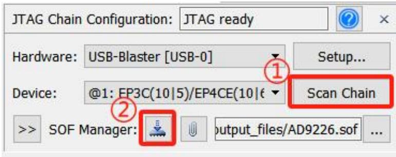

第八步：当点击完下载按钮之后，在软件的左上角会显示“Ready toacquire”，表示下载成功，然后点击


第九步：最后在仿真框中就可以看到仿真波形了，如下图所示：

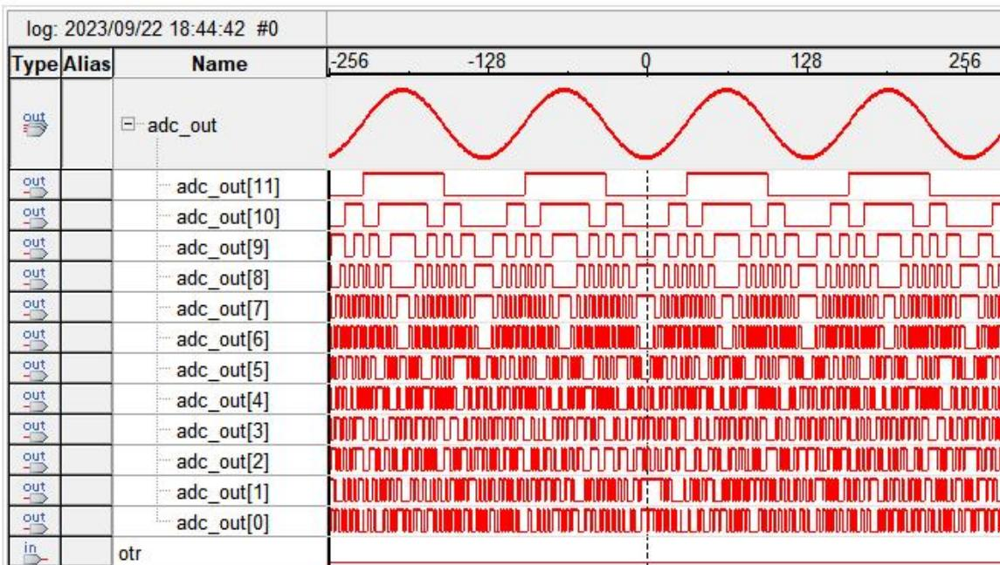<br>
淘宝地址：https://gzkydz.taobao.com

## 3.工作模式说明

AD9226\_2CH 模块有两种工作模式：双通道 65Msps 和单通道 130Msps。

## 双通道 65Msps 模式：

（1）用短路帽连接 B-C，如下图所示：

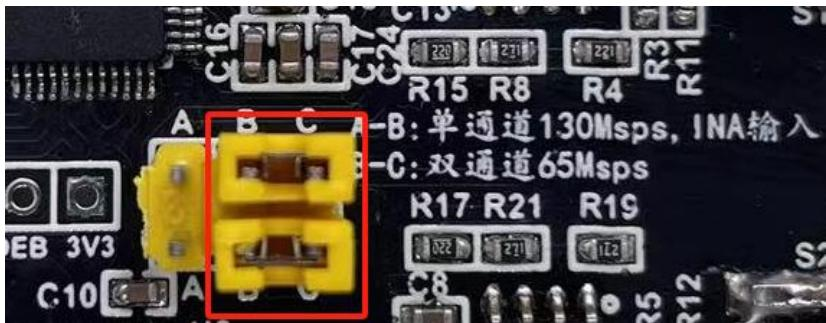

（ 2 ） 两 个 模 式 的 例 程 不 一 样 ， 双 通 道 65Msps 的 例 程 为 ：EP4CE10F17C8N\_AD9226\_2CH\_65Msps\_V1.0。

## 单通道 130Msps 模式：

（1）用短路帽连接 A-B，如下图所示：

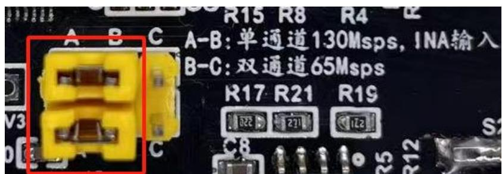

（ 2 ） 两 个 模 式 的 例 程 不 一 样 ， 单 通 道 130Msps 的 例 程 为 ：EP4CE10F17C8N\_AD9226\_130Msps\_V1.0。

## 4.程序移植简单说明

1. 提供的例程使用的是 EP4CE10F17C8N 的主控芯片，如果使用的是同一个芯片，但是开发板不一样的话，只需要按照自己的需求，修改一下引脚分配。

2. 如果使用的不是同一款主控芯片，但是是ALTERA公司的芯片，用的是QuartusII 平台软件，那么只需要修改一下工程的芯片型号，再根据自己的需要，修改一下引脚分配。

3. 如果使用的不是ALTERA公司的芯片，那么可以参考工程的程序，主要的移植点是时序问题，因为 AD9226 的数据输出会延时 3.5ns\~7ns，所以时钟敏

淘宝地址：https://qzkydz.taobao.com感信号相对于AD9226 的时钟要滞后3.5ns\~7ns（例程滞后的是4ns），剩下的就是引脚分配了

<table><tr><td>Parameters</td><td>Temp</td><td>Test Level</td><td>Min</td><td>Typ</td><td>Max</td><td>Unit</td></tr><tr><td>Max Conversion Rate</td><td>Full</td><td>VI</td><td>65</td><td></td><td></td><td>MHz</td></tr><tr><td>Clock Period $^{1}$ </td><td>Full</td><td>V</td><td>15.38</td><td></td><td></td><td>ns</td></tr><tr><td>CLOCK Pulsewidth High $^{2}$ </td><td>Full</td><td>V</td><td>3</td><td></td><td></td><td>ns</td></tr><tr><td>CLOCK Pulsewidth Low $^{2}$ </td><td>Full</td><td>V</td><td>3</td><td></td><td></td><td>ns</td></tr><tr><td>Output Delay</td><td>Full</td><td>V</td><td>3.5</td><td></td><td>7</td><td>ns</td></tr><tr><td>Pipeline Delay (Latency)</td><td>Full</td><td>V</td><td></td><td>7</td><td></td><td>Clock Cycles</td></tr><tr><td>Output Enable Delay $^{3}$ </td><td>Full</td><td>V</td><td></td><td>15</td><td></td><td>ns</td></tr></table>

'The clock period may be extended to 10 μs without degradation in specified performance @ 25°C<br>
2When MODE pin is tied to AVDD or grounded, the AD9226 SSOP is not affected by clock duty cycle<br>
3LQFP package.<br>
Specifications subiect to change without notice

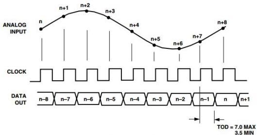<br>
Figure 1. Timing Diagram

## 5.其他说明

模拟量与数字量的关系如下图所示：

<table><tr><td>Input (V)</td><td>Condition (V)</td><td>Binary Output Mode</td><td>Two&#x27;s Complement Mode</td><td>OTR</td></tr><tr><td>VINA-VINB</td><td>&lt; - VREF</td><td>0000 0000 0000</td><td>1000 0000 0000</td><td>1</td></tr><tr><td>VINA-VINB</td><td>= - VREF</td><td>0000 0000 0000</td><td>1000 0000 0000</td><td>0</td></tr><tr><td>VINA-VINB</td><td>= 0</td><td>1000 0000 0000</td><td>0000 0000 0000</td><td>0</td></tr><tr><td>VINA-VINB</td><td>= + VREF - 1 LSB</td><td>1111 1111 1111</td><td>0111 1111 1111</td><td>0</td></tr><tr><td>VINA-VINB</td><td>≥ + VREF</td><td>1111 1111 1111</td><td>0111 1111 1111</td><td>1</td></tr></table>

这里在简单说明一下，数字量与模拟量的关系。根据硬件电路，设置的数据输出格式为直接码。所以数字量与模拟量的关系是：

对应公式： $\mathrm { A } = ( \mathrm { D } { \setminus } 0 \mathrm { x F F F } ) / 4 0 9 5 ^ { \ast } 1 0 0 0 0 \mathrm { m V } { - } 5 0 0 0 \mathrm { m V }$ （由于差分芯片输入到AD9226 是反相的，通过^0xFFF 取反），其中D 为模块输入的数字量（D0\~D11），D^0xFFF 表示 D 与 0xFFF 异或，A 为模拟量，单位 mV。

## 五 、部分测试结果

用户需知：在不同仪器、不同环境下测量的结果，存在一定的偏差属于正常现象。

测量仪器型号：

开发板：FPGA核心板

信号源：RIGOL DG4202

测试平台：QuartusII 13.0

部分测试结果图，如下所示：

测试项一：短路帽连接B-C，双通道65Msps模式，信号输入：频率为500KHz，幅度为9.5V的正弦波，测量结果如下图所示：

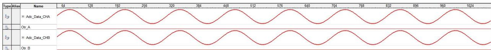

测试项二：短路帽连接B-C，双通道65Msps模式，信号输入：频率为500KHz，幅度为9.5V的三角波，测量结果如下图所示：

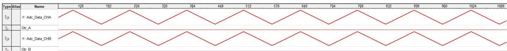

测试项三：短路帽连接B-C，双通道65Msps模式，信号输入：频率为500KHz，幅度为9.5V的方波，测量结果如下图所示：

<table><tr><td>Type/Alias</td><td>Name</td><td>128</td><td>192</td><td>256</td><td>320</td><td>384</td><td>448</td><td>512</td><td>576</td><td>640</td><td>704</td><td>768</td><td>832</td><td>896</td><td>960</td><td>1024</td><td>1088</td></tr><tr><td>Ig</td><td>* Adc_Data_CHA</td><td></td><td></td><td></td><td></td><td></td><td></td><td></td><td></td><td></td><td></td><td></td><td></td><td></td><td></td><td></td><td></td></tr><tr><td>Ig</td><td>Ort_A</td><td></td><td></td><td></td><td></td><td></td><td></td><td></td><td></td><td></td><td></td><td></td><td></td><td></td><td></td><td></td><td></td></tr><tr><td>Ig</td><td>* Adc_Data_CHB</td><td></td><td></td><td></td><td></td><td></td><td></td><td></td><td></td><td></td><td></td><td></td><td></td><td></td><td></td><td></td><td></td></tr><tr><td>Ig</td><td>Ort_B</td><td></td><td></td><td></td><td></td><td></td><td></td><td></td><td></td><td></td><td></td><td></td><td></td><td></td><td></td><td></td><td></td></tr></table>

测试项四：短路帽连接 A-B，单通道 130Msps 模式，INA 接口输入信号：频率为 5MHz，幅度为 9.5V 的正弦波，测量结果如下图所示（其中 Fifo\_24to12|q为输出信号）：

```csv
Type: Alias Name 326 344 352 360 368 376 384 392 400 408 416 424 432 440 448 456 464 472 480 488 496 504 512 520 528 536 544 552 560 568 576 584
Ig Adc_Data_CHA
Ig Otr_A
Ig Adc_Data_CHB
Ig Otr_B
Ig FIFO Fifo_24to12iq
```

测试项五：短路帽连接 A-B，单通道 130Msps 模式，INA 接口输入信号：频率为 5MHz，幅度为 9.5V 的三角波，测量结果如下图所示（其中 Fifo\_24to12|q为输出信号）：

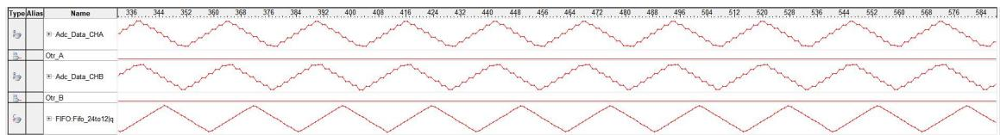

测试项六：短路帽连接 A-B，单通道 130Msps 模式，INA 接口输入信号：频率为 5MHz，幅度为 9.5V 的方波，测量结果如下图所示（其中 Fifo\_24to12|q为输出信号）：

<table><tr><td>Type</td><td>Alias</td><td>Name</td><td>336</td><td>344</td><td>352</td><td>360</td><td>368</td><td>376</td><td>384</td><td>392</td><td>400</td><td>408</td><td>416</td><td>424</td><td>432</td><td>440</td><td>448</td><td>456</td><td>464</td><td>472</td><td>480</td><td>488</td><td>496</td><td>504</td><td>512</td><td>520</td><td>528</td><td>536</td><td>544</td><td>552</td><td>560</td><td>568</td><td>576</td><td>584</td></tr><tr><td>Ig</td><td></td><td>Adc_Data_CHA</td><td></td><td></td><td></td><td></td><td></td><td></td><td></td><td></td><td></td><td></td><td></td><td></td><td></td><td></td><td></td><td></td><td></td><td></td><td></td><td></td><td></td><td></td><td></td><td></td><td></td><td></td><td></td><td></td><td></td><td></td><td></td><td></td></tr><tr><td>IL</td><td></td><td>Otr_A</td><td></td><td></td><td></td><td></td><td></td><td></td><td></td><td></td><td></td><td></td><td></td><td></td><td></td><td></td><td></td><td></td><td></td><td></td><td></td><td></td><td></td><td></td><td></td><td></td><td></td><td></td><td></td><td></td><td></td><td></td><td></td><td></td></tr><tr><td>Ig</td><td></td><td>Adc_Data_CHB</td><td></td><td></td><td></td><td></td><td></td><td></td><td></td><td></td><td></td><td></td><td></td><td></td><td></td><td></td><td></td><td></td><td></td><td></td><td></td><td></td><td></td><td></td><td></td><td></td><td></td><td></td><td></td><td></td><td></td><td></td><td></td><td></td></tr><tr><td>IL</td><td></td><td>Otr_B</td><td></td><td></td><td></td><td></td><td></td><td></td><td></td><td></td><td></td><td></td><td></td><td></td><td></td><td></td><td></td><td></td><td></td><td></td><td></td><td></td><td></td><td></td><td></td><td></td><td></td><td></td><td></td><td></td><td></td><td></td><td></td><td></td></tr><tr><td>Ig</td><td></td><td>FIFO Fifo_24o12q</td><td></td><td></td><td></td><td></td><td></td><td></td><td></td><td></td><td></td><td></td><td></td><td></td><td></td><td></td><td></td><td></td><td></td><td></td><td></td><td></td><td></td><td></td><td></td><td></td><td></td><td></td><td></td><td></td><td></td><td></td><td></td><td></td></tr></table>

## 六 、其他（故障排除+注意事项）

1 接线时还是要特别注意下供电极性，以及不要过压供电。

2 模块为精密的信号处理模块，供电电源建议使用低纹波的线性电源供电；

3 使用不同仪器测量以及在不同的环境下测试结果存在一定的偏差，属于正常现象。

4 信号输入输出建议使用射频同轴线（屏蔽性好），使用普通线材容易接触不良或者引入噪声；

5 输入信号还未达到+5V，输出数据就已经为最大值，原因可能是供电电压过低，影响了可测量电压范围。如果输入信号的最大值误差在0.3V 之

## 双路 AD9226 高速 ADC 模块使用手册

## 欢迎关注我们感谢您的支持与信任

内的话，可能是受模块器件公差的印象，存在微小差异是正常现象。

6 实际测试的电压比输入的电压小一半或者更低，那是因为模块的输入阻抗为50Ω，输入信号驱动能力不够的话，会导致输入到板子的电压下降。

7 ORA引脚和ORB 引脚是数据溢出标志位，例如模块的输入范围为±5V，当输入的信号超出±5V的范围，那么ORA引脚和ORB引脚就会被拉高。

## 七 、附录（赠送资料）

1\_原理图

2\_芯片手册

<br>
3\_使用指南<br>
4尺寸图<br>
5\_程序驱动

## 关于科一电子

我们是一家集研发、生产、销售于一体的技术性企业，支持代理加盟、外贸拼单、学校采购、公司研发采购等模式。多年来深耕于电子模块的研发，目前已开发各类的放大器模块、DDS 模块、检测模块、滤波模块、开发板等等，同时也可承接各类的软硬件产品设计，欢迎广大用户联系咨询。

合作微信：DZ179048065

欢迎扫码关注我司官方店铺


