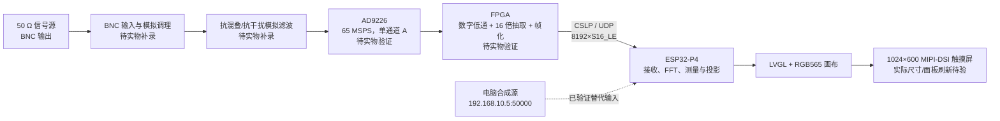
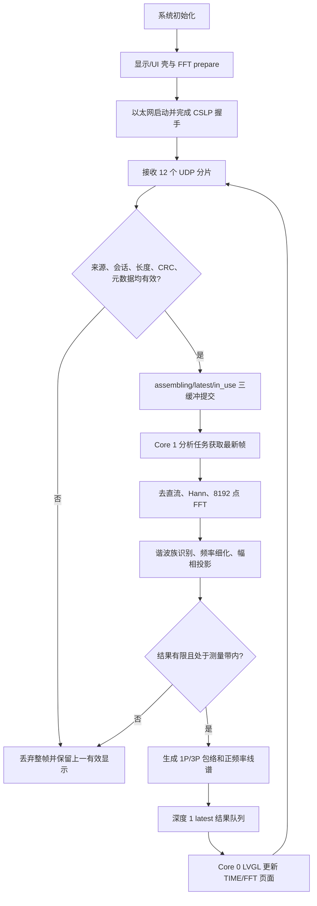

# CycleScope 周期信号测量分析装置设计报告（初稿，非最终提交）

> 文档状态：设计报告初稿，仅用于方案整理、证据审查和实物补录，不可直接作为最终竞赛提交稿。
>
> 依据：[G 题赛题原文](full.md)、[主办方 2026-07-29 21:03 答疑](<../主办方答疑/26电赛问题解答2607292103.txt>)。
>
> 当前板上数字链基线：`main@94dab8f-dirty` 工作树构建的正式 FPGA `.2` freshness normal 镜像，size `0x1132f0`，ELF/BIN SHA256 为 `c3d6e6853e3d2c3b721e2bcd0dfeb64c88a71bbd30d33f0b5e19cafb069fd448` / `23ae1c37fab06e99e058b70ab0cd62fb1287dbb7bcec721b78bfa0218dec8119`，Flash app 区全量读回与 BIN 逐字节一致。P4 启动和 `.3:50001→.2:50000` 配置正常，但首次 45 秒烟测中 FPGA 未返回 HELLO_ACK，故尚未形成真实两板数据 session。修复前 normal v5 的 10,000 帧及矩阵、最终 `.5` freshness 回归均保留为历史分层证据，不能冒充正式 `.2` 已重跑同样规模；`94dab8f` 只标识合并基线，不能单独重建其上的未提交源码。

## 摘要

CycleScope 是面向周期信号测量分析任务设计的双处理平台。拟议实物链路以单颗 AD9226 对输入信号进行 65 MSPS 采样，由 FPGA 完成抗干扰低通、16 倍抽取及帧化，再通过以太网把 4.0625 MSPS、8192 点的采样快照送入 ESP32-P4。ESP32-P4 完成 Hann 加窗、8192 点 FFT、谐波族识别、频率细化、幅相投影、真有效值和峰峰值计算，并在触摸屏上切换显示 1 个周期、3 个周期波形及正频率离散线谱。

软件采用接收、分析、显示分离的实时结构：UDP 接收任务维护三缓冲，分析任务只处理最新完整帧，LVGL 任务只接收固定容量的显示结果。修复前 normal v5 已在“电脑合成采样数据 → 以太网 → ESP32-P4”范围内完成 10,000 帧、动态量程迟滞/断链恢复、四例题目边界各 100 帧、六例高阶谐波各 100 帧和滤后残余；v4 结果与 66 例主机相位参数扫描保留为对照。v5 10,000 帧中接收、分析、发布均为 10,000，正式数据窗口内全部已检查错误计数为零，FFT 最终平均耗时 17.491 ms、最大耗时 50.210 ms。最终 freshness 代码另以主机 9 个边界和板上 STATUS-only/掉线/新帧恢复验证数据新鲜度，不改写上述历史 10,000 帧身份；同一代码已按生产 `.2` 配置 fresh 构建、烧录并读回验证，目前等待 FPGA responder 完成首次握手。

现有证据不覆盖真实 BNC 输入、模拟前端、AD9226、FPGA 低通与抽取、200 mVpp 干扰抑制、单路 5 V 供电、与真实 FPGA `.2` 成功建立 CSLP 数据 session、屏幕实际尺寸以及触摸按键到面板刷新完成的端到端时间。这些项目在本文中均明确列为“待实物补录/验证”，不以电脑合成数据或 ICMP 在线替代实物结论。

**关键词：** 周期信号；谐波分析；Hann 窗；真有效值；ESP32-P4；AD9226；FPGA；FFT

## 1. 任务理解与验收口径

### 1.1 主要指标

| 项目 | $u_a$ | $u_b$ | $u_b+u_J$ |
|---|---:|---:|---:|
| 合成波形整体峰峰值 | 100～250 mVpp | 50～250 mVpp | $u_b$ 为 50～250 mVpp，另加 200 mVpp 干扰 |
| 被测频率成分范围 | 10～200 kHz | 10～500 kHz | $u_b$ 为 10～500 kHz，$f_J\geq 1$ MHz |
| 信号构成 | 基波 + 1 或 2 个谐波 | 基波 + 1 或 2 个谐波 | 同 $u_b$，再叠加单频正弦干扰 |
| 波形显示 | 键控选择 1 个或 3 个完整周期 | 同左 | 抑制干扰影响后显示 $u_b$ |
| 数值误差 | $U_{pp}$、真 RMS 均不超过 5 mV；$f_0$ 不超过 1 kHz | 同左 | 同左 |
| 频谱 | 正频率离散线谱；各分量峰值误差不超过 5 mV | 同左 | 同左 |
| FFT 频点间隔 | 不大于 500 Hz | 不大于 500 Hz | 不大于 500 Hz |

### 1.2 主办方答疑形成的设计约束

1. 题目中的 50～250 mVpp 或 100～250 mVpp 指整个合成波形的峰峰值，不是单个分量的峰峰值。
2. 频谱“幅值”统一解释为正弦分量的峰值，本文以 `mVpk` 标注，避免与 `mVpp`、`mVrms` 混淆。
3. 每个频率分量均不小于 5 mVpk；基波不保证强于谐波，谐波阶次由现场指定，最高频率不超过相应测量带宽。
4. 三类输入均为纯交流信号，没有题设直流分量；真有效值按定义计算，不要求采用专用硬件 RMS 芯片。
5. FFT 频点间隔应不大于 500 Hz，现场基频为 500 Hz 的整数倍；算法仍应容忍非相干采样和小的时钟/量化偏差。
6. 频谱只要求正频率轴上的离散线谱，不要求相位图；触摸屏虚拟按键可作为键控方式。
7. 2 s 计时从系统已经完全启动、测量链已经运行后，专家要求开始测量并按下相应功能键时开始。约 3.5～4.4 s 的冷启动时间不直接计入该 2 s 窗口。
8. 外部只能接一台实验室直流稳压电源的一路 5 V；装置内部可以变换出其他电压轨。
9. 信号源输出阻抗为 50 Ω，测量值原则上以信号发生器设置值为基准。装置输入端没有被强制要求做 50 Ω 终端，但实际输入方式和标定关系必须在实物中确认。

### 1.3 题目要求—设计—证据追踪

| 题目要求 | 设计措施 | 理论依据 | 当前证据 | 状态 |
|---|---|---|---|---|
| FFT 频点间隔不大于 500 Hz | 65 MSPS 经 16 倍抽取，P4 做 8192 点 FFT | $65\times10^6/(16\times8192)=495.910645$ Hz | normal v5 启动门禁与 P4 日志固定 $f_s/N$ | P 级已证；真实 FPGA 时钟待验 |
| 1P/3P 完整波形 | H1 相位锚定，同帧预计算 1P/3P 包络 | 以基波周期 $T_0=1/f_0$ 选窗并保持端点连续 | 主机相位扫描、Display-only v8 控件契约 | 软件部分证明；真实 panel flush/观感待验 |
| Vpp、真 RMS、$f_0$ 与线幅误差 | Hann、谐波族联合估频、幅相投影、重建求 Vpp、正交和求 RMS | 纯交流整数谐波正交；Vpp 由实际相位决定 | v5 四边界 4×100、六例高阶 6×100、10k 长测 | P 级数字链已证；实物误差待验 |
| 正频率 2～3 根离散线谱 | 只绘通过谐波族校验的 H1 与 1 个或 2 个谐波 | 单边谱幅值校正并按真实频率映射 0～500 kHz | 500 kHz 边界、弱 H1/H50、投影自测 | P/H 级部分证明；面板视觉待验 |
| 200 mVpp、$f_J\geq1$ MHz 干扰下仍测量 $u_b$ | ADC 前模拟抗混叠/抗干扰，FPGA 抽取前数字低通，P4 排除带外线 | 混叠一旦进入带内，P4 后级无法恢复 | 仅有 1 MHz、0.316 mVpk 滤后残余数字测试 | E 级未证明 |
| 专家按键后不超过 2 s | 系统提前启动并持续分析；20 Hz 数据、latest UI、即时按键切换 | 冷启动不计时，门禁为按键到真实上屏 | FFT/回调分段预算，不含 panel flush | 待人工端到端验收 |
| 单路 5 V、屏幕不小于 6 英寸、板载输入座/50 Ω 线缆 | 目标结构已预留 | 题面与答疑约束 | 尚无实物照片、尺量和供电记录 | 待实物补录 |
| 真实 FPGA 两板链 | `.2:50000 → .3:50001` 生产地址与 CSLP Profile 1 | FPGA 先滤波抽取再帧化 | 当前只验证电脑 `.5 → P4 .3` | 待两板联调 |

## 2. 方案论证与选择

### 2.1 总体方案比较

| 环节 | 备选方案 | 优点 | 主要问题 | 选择 |
|---|---|---|---|---|
| 高速采样 | 双 ADC 交织至 130 MSPS | 等效采样率高 | 需要校准通道增益、偏置和相位失配，复杂度和不确定性高 | 不采用 |
| 高速采样 | 单颗 AD9226，65 MSPS | 已能远高于 500 kHz 信号带宽；无交织失配 | 仍需完成输入调理、时钟和码型确认 | 采用，实物参数待补录 |
| 干扰抑制 | 仅在 ESP32-P4 上做数字截带 | 软件灵活 | 高频干扰可能在 ADC 或抽取前混叠，无法只靠后级修复 | 不单独采用 |
| 干扰抑制 | 模拟抗混叠 + FPGA 数字低通/16 倍抽取 | 在降采样前限制混叠，显著降低传输与运算量 | 模拟电路、FPGA 滤波器系数和实测阻带尚缺 | 采用为目标方案，待实物验证 |
| 分析分工 | FPGA 完成全部 FFT、测量和 UI 数据 | 实时性强 | 调试与迭代成本高，算法改动不便 | 不采用 |
| 分析分工 | FPGA 采集/滤波/抽取，P4 完成 FFT、测量和显示 | 硬实时采集与灵活算法分离，便于显示交互 | 依赖可靠的两板数据协议 | 采用 |
| 频谱估计 | 直接读取矩形窗 FFT 单一 Bin | 实现简单 | 非相干采样时泄漏明显，5 mVpk 弱分量误差风险大 | 不采用 |
| 频谱估计 | Hann 窗 + 峰值插值 + 精确频率投影 | 抑制泄漏，并对相干增益作幅值校正 | 运算量增加 | 采用 |
| 板间传输 | TCP 字节流 | 有序可靠 | 重传可能造成旧帧积压，实时显示延迟不可控 | 不采用 |
| 板间传输 | UDP + 应用层控制 ACK + 数据帧 CRC | 控制可靠、数据低延迟；可丢弃不完整旧帧 | 需自行完成重组和会话管理 | 采用 CSLP |
| 绘图 | 大量 LVGL 矢量线段 | 代码直观 | 高频重绘曾触发看门狗，任务开销高 | 不采用 |
| 绘图 | PSRAM RGB565 画布 + min/max/peak 聚合 | 绘图负载可控，并保留尖峰 | 需要固定缓冲和投影逻辑 | 采用 |

### 2.2 最终选择

目标整机采用“模拟前端 + AD9226 + FPGA + 以太网 + ESP32-P4 + MIPI-DSI 触摸屏”的分层结构。ADC 前的模拟网络负责抗混叠与前端抗干扰；FPGA 负责不能延后的采样接口、抽取前数字低通/抗折叠、抽取和帧化；P4 负责题目相关的测量、波形/频谱投影与人机交互。该结构避免双 ADC 交织校准，同时把 65 MSPS 原始数据在板间传输前降为 4.0625 MSPS，使百兆以太网和 P4 软件分析都具有足够余量。

需要强调：上述为选定的产品架构。当前已经验证的是电脑按同一帧格式合成数据并送入 P4；真实采集和 FPGA 前处理仍不能据此判定完成。

## 3. 系统架构与数据接口

### 3.1 整机原理框图

### 3.2 固定数据 Profile

| 参数 | 设计值 | 说明 |
|---|---:|---|
| ADC 原始采样率 | 65,000,000 S/s | 单颗 AD9226 的目标采样时钟 |
| 抽取倍数 | 16 | 抽取前必须完成足够的低通抑制 |
| 线上采样率 | 4,062,500 S/s | $65\text{ MSPS}/16$ |
| 每帧样点 | 8192 | 单通道 `S16_LE` |
| 单帧采样窗口 | 2.016492 ms | $8192/4{,}062{,}500$ |
| FFT 正频率点 | 4097 | 包括 DC 和 Nyquist 点 |
| FFT 栅格 | 495.910645 Hz | 满足不大于 500 Hz |
| 数据发布周期 | 50 ms | 20 frame/s |
| UDP 数据包 | 12 包/帧 | 数据面不重传，坏帧整帧丢弃 |
| 原始样点净载荷 | 327,680 B/s | $8192\times2\times20$，约 2.62 Mbit/s |

生产设计的 FPGA 地址为 `192.168.10.2:50000`，P4 为 `192.168.10.3:50001`。normal v5 电脑联调取证使用隔离地址 `192.168.10.5:50000 → 192.168.10.3:50001`，只作为历史 P 级证据。当前板上已恢复正式 `.2` 镜像；首次烟测虽确认两端 ICMP 在线，但尚无 HELLO_ACK，不能据此宣称两板生产链已建立。

### 3.3 P4 任务与所有权结构

接收任务运行于 Core 1、优先级 6；分析任务运行于 Core 1、优先级 4；LVGL 只在 Core 0/UI 上下文访问。分析路径按 `acquire → process → frame_is_current → publish → release` 执行，同一时刻最多持有一个接收槽。UI 队列深度为 1，显示可以跳过过时结果，但不能反向阻塞网络接收。

## 4. 理论分析与关键计算

### 4.1 采样率、抽取与 FFT 分辨率

原始采样率为

$$
f_{s0}=65\ \mathrm{MSPS}.
$$

为使 8192 点 FFT 的频点间隔不大于 500 Hz，抽取倍数 $D$ 至少满足

$$
\frac{65\times10^6}{D\times8192}\leq500,
\qquad
D\geq\frac{65\times10^6}{500\times8192}=15.869140625.
$$

因此选择整数抽取倍数 $D=16$。FPGA 在抽取前完成数字低通后，线上采样率为

$$
f_s=\frac{65\times10^6}{16}=4{,}062{,}500\ \mathrm{S/s}.
$$

8192 点 FFT 的频点间隔为

$$
\Delta f=\frac{f_s}{N}
=\frac{4{,}062{,}500}{8192}
=495.91064453125\ \mathrm{Hz}<500\ \mathrm{Hz}.
$$

抽取后 Nyquist 频率为 2.03125 MHz，覆盖 0～500 kHz 被测带宽和 1 MHz 干扰起始点。但主办方没有规定干扰频率上限，超过 Nyquist 的干扰可能在 ADC 采样或抽取时折返测量带，因此不能只依赖 P4 的“忽略 500 kHz 以上谱线”。ADC 前的模拟滤波负责限制采样混叠，FPGA 数字低通负责抽取前抗折叠；两者的实际通带、阻带均须在实物中验证。

最低 10 kHz 基波在抽取后每周期约有 406.25 点，最高 500 kHz 分量每周期约有 8.125 点。8192 点窗口可容纳约 20.16 个 10 kHz 周期，因此从窗中选择连续 1P/3P 显示区间具有足够长度。

### 4.2 标定、去直流与采样物理量

CSLP 帧携带 `scale_uV_per_lsb`、`offset_uV`、采样率、配置号和校准号。第 $n$ 个码值 $q[n]$ 转为电压：

$$
x[n]=q[n]\,K_{LSB}+V_{off}.
$$

分析前计算窗口均值

$$
\bar{x}=\frac{1}{N}\sum_{n=0}^{N-1}x[n],\qquad
x_c[n]=x[n]-\bar{x}.
$$

答疑明确题设信号为纯交流；去均值可以抑制 ADC/前端偏置对 AC 参数和频谱的污染。normal v5 电脑证据采用 $K_{LSB}=100\ \mu\mathrm{V/LSB}$、$V_{off}=500\ \mu\mathrm{V}$，这只是合成数据标定配置，不代表真实前端已经达到该比例。

### 4.3 Hann 窗与单边幅值校正

为降低非相干采样时的谱泄漏，对去直流数据加 Hann 窗：

$$
w[n]=\frac{1}{2}\left(1-\cos\frac{2\pi n}{N-1}\right),\qquad
X[k]=\sum_{n=0}^{N-1}x_c[n]w[n]e^{-j2\pi kn/N}.
$$

程序不把 Hann 窗造成的约 0.5 相干增益误认为幅值衰减，而是直接用实际窗和

$$
W=\sum_{n=0}^{N-1}w[n]
$$

归一化。除 DC 和 Nyquist 点外，正频率单边峰值谱为

$$
A[k]=\frac{2|X[k]|}{W}.
$$

因此屏幕与数值表中的谱线单位为 Vpk/mVpk。DC 与 Nyquist 点不乘 2，避免单边折叠的重复计数。

### 4.4 谐波族识别、频率细化与幅相投影

算法先在 10～500 kHz 正频率范围内寻找局部峰值，对相邻三个 Bin 的对数幅值作抛物线插值，再选择满足整数倍关系的“基波 + 1 个或 2 个谐波”族。候选谐波最高支持 H50，既覆盖 10 kHz 基波的 500 kHz 边界，也能处理谐波强于基波的情况。

对每条候选谱线，程序在初值附近用 $-0.15\Delta f$、$0$、$+0.15\Delta f$ 三个频点进行投影和二次细化。各谐波反推的基频按幅值平方和谐波阶次加权：

$$
\hat f_0=
\frac{\sum_i (\hat f_i/h_i)A_i^2h_i^2}
     {\sum_i A_i^2h_i^2},
$$

其中 $h_i$ 为谐波阶次。随后在 $h_i\hat f_0$ 上直接计算复投影

$$
C_i=\sum_{n=0}^{N-1}x_c[n]w[n]
e^{-j2\pi h_i\hat f_0 n/f_s},
$$

并得到

$$
\hat A_i=\frac{2|C_i|}{W},\qquad
\hat\phi_i=\operatorname{atan2}(\Im C_i,\Re C_i)+\frac{\pi}{2}.
$$

相位不作为题目显示参数，但用于合成波形峰峰值和稳定的 1P/3P 起点。任何非有限、越界、零动态范围或缺少 H1 的结果均关闭发布，不用错误数据“凑出一屏”。ESP32-P4 的特定 ARP4 优化 FFT 内核曾在弱、相位敏感输入下产生错误谱，normal v5 基线固定使用经验证的 `dsps_fft2r_fc32_ansi` 路径。

### 4.5 真有效值与合成波形峰峰值

真有效值定义为

$$
U_{RMS}=\sqrt{\frac{1}{T_0}\int_0^{T_0}u^2(t)\,dt}.
$$

对题设纯交流、整数次正弦谐波

$$
u(t)=\sum_i A_i\sin(2\pi h_i f_0t+\phi_i),
$$

不同谐波在一个基波周期内正交，故

$$
U_{RMS}=\sqrt{\frac{1}{2}\sum_i A_i^2}.
$$

该表达式与各分量相位无关，是按定义得到的真有效值，不是平均值响应表的“正弦标定 RMS”。

合成波形的峰峰值不能简单写成 $2\sum_i A_i$，因为各谐波相位会改变极值位置。程序利用估计的 $A_i$、$h_i$ 和 $\phi_i$，在一个基波周期内等间隔重建 4096 点，计算

$$
U_{pp}=\max_m \hat u[m]-\min_m \hat u[m].
$$

这样得到的是整个合成波形的峰峰值，与主办方答疑口径一致。

### 4.6 1P/3P 波形投影

估计基波相位为 $\phi_1$ 时，下一个 H1 上升过零点相对帧首的位置为

$$
n_0=\frac{(-\phi_1)\bmod 2\pi}{2\pi}\frac{f_s}{f_0}.
$$

所有 $n_0+kf_s/f_0$ 都是等价的 H1 上升过零点。程序选择使完整 3P 区间尽量位于 8192 点 Hann 窗中心的那个等价起点，1P 与 3P 共用同一小数采样锚点。该方法避免 H3/H4 或 H49/H50 强于 H1 时，直接寻找复合波形过零点造成跨帧跳相。

每种显示均把原区间投影为 640 列 min/max 包络；640 列再映射到 638 像素画布时继续做区间 min/max 聚合。端点采用线性插值，列内整数采样全部参与，因此窄峰不会因降采样绘图而消失。

### 4.7 正频率离散线谱显示

FFT 保留 4097 个 $0\sim f_s/2$ 单边 Bin，显示只压缩 $0\sim500$ kHz 范围。normal v5 的正式 FFT 页面只绘制已经通过谐波族校验的 2～3 根语义谱线，避免把 Hann 主瓣和旁瓣画成大量“假分量”。横坐标按频率映射，纵坐标按分量峰值映射；幅度档位为 20、50、100、200、300、500 mVpk，并使用上切 15% 触发、下切 25% 余量的迟滞，状态只在 current 帧成功发布后提交。频率和幅值数值与线谱使用同一份投影结果。

## 5. 硬件组成与待补录电路

### 5.1 已选硬件平台

| 模块 | 选型/目标 | 当前状态 |
|---|---|---|
| ADC | 单颗 AD9226，通道 A，65 MSPS | 方案冻结；真实接线、码型和采样尚未验证 |
| FPGA | Zynq 平台，负责低通、16 倍抽取、CSLP 帧化 | 目标架构；真实 `.2` 两板链未验证 |
| 主控 | ESP32-P4 Function EV Board v1.0，360 MHz，16 MB Flash，32 MB PSRAM | normal v5 电脑数据链已上板验证 |
| 网络 | P4 IP101/RMII 百兆以太网，静态 IPv4/UDP | 电脑 `.5 → P4 .3` 已验证；FPGA `.2` 未验证 |
| 显示 | 1024×600 MIPI-DSI、EK79007、GT911、LVGL 9.4 | 初始化和软件回调已验证；尺寸及真实 panel flush 待验 |
| 供电 | 外部单路 5 V，内部按需变换 | 题目要求明确；整机实物供电树待补录/验证 |

### 5.2 模拟输入与 ADC 电路

拟议链路为“板载输入座 → 保护/偏置/量程调理 → 抗混叠与抗干扰滤波 → AD9226”。由于现有资料没有给出可靠的实物原理图和器件值，以下内容不能臆造：

- BNC/SMA 输入座型号、是否设置 50 Ω 终端、保护器件与输入允许范围：**待实物补录**。
- 运算放大器/变压器/全差分驱动器型号、增益、共模与偏置：**待实物补录**。
- 模拟滤波器阶数、拓扑、截止频率、电阻电容值和实测幅频响应：**待实物补录**。
- AD9226 参考电压、输入满量程、65 MHz 时钟源与抖动指标：**待实物补录**。
- AD9226 `MODE/DFS` 码型、数据极性、流水线延迟和 `OTR` 对齐：**待实物补录并用直流/斜坡/正弦实测确认**。

> 电路图 H1——BNC 输入、保护、终端和前端驱动：**待实物补录**。
>
> 电路图 H2——抗混叠/抗干扰模拟滤波器及器件值：**待实物补录**。
>
> 电路图 H3——AD9226 参考、时钟、数据与 OTR 接线：**待实物补录**。

### 5.3 FPGA 采集与数字滤波

FPGA 目标功能包括 AD9226 并行采样、抽取前低通、16 倍抽取、8192 点快照、元数据封装和 UDP 发送。抽取滤波器必须同时满足 0～500 kHz 通带幅值精度和对高频干扰/混叠的抑制要求。

> 逻辑图 H4——ADC 接口、FIFO、滤波器、抽取、DMA/以太网数据路径：**待真实 FPGA 工程补录**。
>
> 表 H5——滤波器结构、阶数、系数位宽、通带纹波、阻带衰减和群时延：**待设计与实测补录**。

当前电脑合成数据直接生成已经抽取、标定后的 `S16_LE` 样点，因此没有经过上述硬件，不能作为 FPGA 滤波正确性的证据。

### 5.4 单路 5 V 与结构接口

竞赛实物必须只从一路 5 V 直流稳压电源取电；各板所需 3.3 V、1.8 V、模拟电源或其他电压应由装置内部转换。最终报告需补充电源树、各路额定电流、纹波、启动次序和整机 5 V 电流实测。

> 电路图 H6——单路 5 V 输入、保护与各级 DC-DC/LDO：**待实物补录**。
>
> 结构图 H7——板载输入座、50 Ω 电缆、屏幕固定和整机连接：**待实物补录**。
>
> 显示屏实际对角尺寸及“≥6 英寸”证明：**待实物测量/铭牌照片补录**。

## 6. 软件设计

### 6.1 CSLP 接收与容错

控制面使用应用层 ACK、100 ms 超时、最多 3 次重试和同序号幂等缓存；数据面不进行帧 ACK、重传或背压。每个 8192 点帧分为固定 12 个 UDP 包，接收端检查来源地址、协议版本、会话、长度、CRC、配置和元数据。缺片、重复、过期或校验失败时丢弃整帧并保持上一有效结果。

三缓冲角色为 `assembling/latest/in_use`。新完整帧可覆盖尚未被使用的 `latest`，但绝不覆盖正在分析的 `in_use`。会话 ID 与帧 ID 共同构成帧身份，防止 FPGA/模拟器重启后低帧号被误判为旧数据。

### 6.2 FFT 与测量处理

分析任务按以下顺序处理一帧：

1. 校验样点数、采样率、标定和配置身份；
2. 物理量标定、去直流、Hann 加窗；
3. 8192 点 FC32 FFT、位反转和 4097 点单边幅值校正；
4. 10～500 kHz 峰值候选、整数谐波族选择和频率细化；
5. 在精确谐波频率上计算幅值与相位；
6. 计算 $f_0$、真 RMS、合成波形 $U_{pp}$；
7. 生成 1P/3P min/max 包络和 0～500 kHz 频谱投影；
8. 在发布前再次确认接收帧仍是当前有效帧，然后写入深度 1 显示队列。

输入指针、相位、采样率、频率、Vpp、RMS、谱线幅值、投影范围任一非法时均 fail-closed。启动时还运行普通多音与弱基波精确向量门禁，避免错误 FFT 内核或参数悄悄进入正式链路。

### 6.3 显示与交互

触摸键提供 TIME/FFT 页面切换和 1P/3P 周期选择。时域使用 638×302 RGB565 PSRAM 画布，频域使用 638×284 RGB565 PSRAM 画布；P4 Core 0 只渲染已经投影好的固定容量数据，不访问网络接收槽或执行 FFT。

最新 Display-only v8 取证中的程序化事件按 `TIME → FFT → TIME → 1P → 3P` 执行两轮，控件状态均通过，最大单次软件回调为 18.827 ms。最终 freshness 固件又将 transport online 与 data freshness 分开：最后一次成功应用到 UI 的 current 有效帧是唯一续期点；`1000 ms` 无新有效帧后，250 ms 轮询在约 `1.0～1.25 s` 内显示 ONLINE 或 OFFLINE STALE；STALE 锁存且只有新有效帧恢复 LIVE。主机 9 个边界以及板上 STATUS-only、peer-silent 和新 measurement 恢复均已通过。上述结果只证明软件状态、事件与重绘提交，不证明像素已经由 MIPI-DSI 面板完成刷新。

## 7. 测试方案与结果

### 7.1 证据分层

为避免把仿真说成实物，本文采用三级证据：

| 级别 | 数据路径 | 能证明的内容 | 不能证明的内容 |
|---|---|---|---|
| H：主机测试 | 电脑进程内生成 S16，主机 shim 调用产品算法 | 数学算法、边界、内存安全、投影一致性 | P4 内核、PSRAM、实时调度、网络和实物硬件 |
| P：电脑 → P4 | 电脑 UDP 合成源 → P4 接收/FFT/UI bridge | P4 数字接收、分析、发布、数值与软件时限 | BNC、模拟前端、ADC、FPGA 滤波、真实干扰、panel flush |
| E：整机实物 | 信号源 → BNC → 前端/ADC/FPGA → P4 → 屏幕 | 题目最终验收 | 当前尚未完成 |

### 7.2 修复前 normal v5 历史取证基线

normal v5 是修复前的电脑联调历史镜像。它在 v4 的数字测量链上增加了频谱量程迟滞和显式断链 STALE 状态；fresh 构建的本地测试片段为空，使用 `-O2`，heap trace、startup/runtime/display 故障夹具及 diagnostic consumer 均未编入。镜像大小为 `0x112f20`，ELF/BIN SHA256 分别为 `6d15ace8dff278791383373d11119ff00b049c42a4e105e97e9251145e44492b`、`075c3ec7028082e032823af39c2b2cbf09610d37dedbb3c1515a4586b78ed3c6`。从 Flash app 分区 `0x20000` 完整读回 `0x112f20` 字节后与 BIN 逐字节一致。该镜像来自 `94dab8f-dirty` 工作树；在完整源码差异被冻结或提交前，commit 与镜像哈希不能合并写成“可由该 commit 唯一复现”。

| 测试 | 输入与规模 | 关键结果 | 证据边界 |
|---|---|---|---|
| v5 动态迟滞 | H3 峰值先在 `83.2/83.5 mVpk` 交替，再跨上下阈值；80 帧 | 前 40 帧无抖档；frame 41 `100→200 UPSHIFT`；frame 61 `200→100 DOWNSHIFT` | P 级状态机 PASS |
| v5 断链恢复 | 动态 session 退出后再建 20 帧 recovery session | `WAITING→LIVE→STALE→LIVE→STALE`；只有新有效帧解除 STALE | P 级 UI 状态 PASS；不含 panel flush |
| v5 四例题目边界 | 50/100/250 mVpp；10/200/500 kHz；2/3 根谱线；每例 100 帧 | sessions `BA29D2A6`～`BA29D2A9`；累计 completed=`100/200/300/400`；最大 F0/Vpp/RMS/线频/线幅误差=`0.060 Hz / 0.004 mV / 0.001 mV / 0.120 Hz / 0.003 mV`；末例后进入 STALE | P 级数字边界 PASS |
| v5 长稳定性 | $f_0=40.75$ kHz；H1/H3/H4=`25/70/25 mVpk`；10,000 帧、120,000 包；故意偏离 500 Hz 整数网格的非相干压力向量 | session `C540EE79`；`completed=acquired=analyzed=published=10000`；正式数据窗口内所有已检查错误为 0；证据窗口持续 501.383 s | P 级数字链 PASS；不冒充现场合法指定频点 |
| v5 长测资源/时限 | 同上 | FFT 最终平均/最大=`17.491/50.210 ms`；internal 最低 `118811 B`，稳态 PSRAM `28040080 B`；恒定输入只提交一次 `NEW_STREAM→100 mVpk` | 50.210 ms 是真实长尾，不能写成始终 15～25 ms |
| v5 六例高阶 | H19/H20/H47/H50、5 mVpk 弱分量；每例 100 帧 | sessions `04E91356`～`04E9135B`；最大 F0/Vpp/RMS/线频/线幅误差=`0.070 Hz / 0.040 mV / 0.009 mV / 0.140 Hz / 0.013 mV` | P 级高风险形状 PASS |
| v5 滤后残余 | 20 kHz H1/H3/H5 + 1 MHz、0.316 mVpk H50；100 帧 | session `325A36C4`；仅输出 20/60/100 kHz 三线；frame 1/100 一致；结束后 LIVE→STALE | 只证明滤后数字链，不证明真实 200 mVpp 干扰 |
| v5 Flash 读回 | app 分区全量 `0x112f20` 字节 | 读回 SHA256 与 BIN 均为 `075c3ec7…d3c6`，`cmp IDENTICAL` | 修复前历史镜像身份闭环 |

v5 长测的 50.210 ms 最大值略高于 50 ms 帧周期，但正式数据窗口内仍无 stale、invalid、FFT failure 或接收/分析/发布计数缺口。数据源退出后的 peer-silent 与 `LIVE→STALE` 是预期生命周期，不得误写成“整份日志从未出现 STALE”，也不属于正式流量失败。产品结论因此采用业务闭环和按键后 2 s 为门禁，同时如实报告平均值与最大值；旧证据解析器的 `<50 ms` 阈值不能被偷换成当前题目失败条件。

#### 7.2.1 最终 freshness 固件与在线回归

最终无夹具 normal `.5` 固件只在 UI 新鲜度状态机上做外科手术式修改：以最后成功 `apply_live_measurement()` 的本地 tick 为锚，超时门限 `1000 ms`，STALE 锁存；receiver、CSLP、FFT、投影和性能参数保持不变。ESP-IDF 6.0.2 fresh build size 为 `0x1132f0`，app 分区余量 87%；ELF/BIN SHA256 为 `2ebee5dd3be61853681c19e15b2c7083d36b305c66f6a88f45f089d856d3e912` / `9762c4ab036930abd7f9f838c61c2cdcac18f6bad2ff96e4aaf8229fc3f319ef`。固件烧录后从 app 分区读回全部 `0x1132f0` 字节，SHA 与 BIN 相同且 `cmp IDENTICAL`。

| 测试 | 输入与规模 | 关键结果 | 证据边界 |
|---|---|---|---|
| 主机新鲜度边界 | 9 个分类状态；`-Werror + ASan/UBSan` | 首帧缺失、在线超时、掉线、锁存、恢复和 tick 回绕全部 PASS | H 级逻辑/内存安全 |
| STATUS-only 在线过期 | session `7BACBD99`；20 帧/240 包后持续 STATUS 3 s | frame 20 后 `age=1000 ms` 时 `LIVE→ONLINE STALE`；health `completed=acquired=20`，frame/reject/socket 错误为 0 | P 级直接命中“在线但无新有效帧”；前置握手重试不属于正式 session |
| 发送端退出 | 同一 session 的 STATUS 停止 | 先 peer-silent，随后 `ONLINE STALE→OFFLINE STALE`；旧 frame 20 不恢复 LIVE | P 级 transport/freshness 分离 |
| 新帧恢复 | session `7BACC34A`；1 个新有效帧 | frame 1 measurement 后才 `STALE→LIVE`；session-ready 本身不解锁 | P 级唯一恢复路径；不含 panel flush |

最终 freshness 固件没有重跑历史 10,000 帧或六例高阶矩阵，因此本文保留两套明确身份：旧 v5 证明大规模数字链，最终镜像证明新增数据新鲜度语义、构建/烧录和 Flash 身份。二者不能拼成“一份最终镜像完成全部测试”。

#### 7.2.2 正式 `.2` 镜像恢复与首次握手

在独立 `/tmp/cyclescope-p4-fpga-formal-sdkconfig` 与 `/tmp/cyclescope-p4-fpga-formal-build` 中 fresh 构建正式 FPGA 配置。审计确认 P4 为 `192.168.10.3:50001`、peer 为 `192.168.10.2:50000`，`CYCLESCOPE_LOCAL_TEST_CMAKE` 为空，`-O2` 生效，heap trace、diagnostic consumer、DISABLE_PUSH 和全部 fault fixture 均关闭；主机 freshness 9 边界与模拟器自检继续 PASS。正式 app size 为 `0x1132f0`，ELF/BIN SHA256 分别为 `c3d6e6853e3d2c3b721e2bcd0dfeb64c88a71bbd30d33f0b5e19cafb069fd448`、`23ae1c37fab06e99e058b70ab0cd62fb1287dbb7bcec721b78bfa0218dec8119`。

bootloader、partition table 和 app 三段烧录及 esptool 写后校验均通过。从 Flash app 分区完整读回 `0x1132f0` 字节后，SHA256 与正式 BIN 相同且 `cmp IDENTICAL`；读回后已 hard reset，板上保持该正式 `.2` 镜像。首次 45 秒 UART 烟测中，P4、PSRAM、显示、普通 FFT、exact weak FFT、IP101 和 `UDP 192.168.10.3:50001 -> 192.168.10.2:50000` 均正常，但 42 次 HELLO 全部 timeout，`CSLP session ready` 与 measurement 均为 0，且没有 panic、WDT、assert、abort 或 socket fatal。

同机检查确认 FPGA `.2` 与 P4 `.3` 均 ping 2/2、电脑临时 `.5` 已撤掉、UDP 50000/50001 无本机进程占用。电脑交换机端口上的 pcap 为 0 包，是因为 `.3↔.2` 单播不经过该观察端口，不能作为“P4 未发送 HELLO”的证据。当前结论严格限定为：正式 P4 镜像已就绪，FPGA 尚未返回 HELLO_ACK；联调还没有进入 CONFIG_SET、ENABLE_PUSH 或 WAVE_DATA 阶段。

### 7.3 normal v4 对照基线

normal v4 是一份已冻结哈希的电脑联调证据基线，不是后续代码的自动背书。其镜像大小为 `0x1129a0`，ELF/BIN SHA256 分别为 `0c36dc5833d666c2e467ca07887779b5b3bc19344f7033aa62dddbad22fe1ee0`、`b4793a9f65befbb418ffd159cd42cc185cbbec5afeea5c3a2f61013a5cd934f7`；Flash app 区读回与 BIN 逐字节一致。

| 测试 | 输入与规模 | 关键结果 | 证据边界 |
|---|---|---|---|
| v4 长稳定性 | $f_0=40.75$ kHz；H1/H3/H4=`25/70/25 mVpk`；10,000 帧、120,000 包 | session `84FA2027`；101 个 measurement 检查点；`acquired=analyzed=published=10000`；全部已检查错误为 0；流持续 501.300 s | P 级数字链 PASS |
| v4 长测数值 | 同上 | F0/Vpp/RMS=`40750.00 Hz / 181.418 mV / 55.452 mV`；三线=`25.000/70.000/24.999 mVpk`；最大 F0/电压/谱线频率/谱线幅值误差=`0 / 0.003 mV / 0.020 Hz / 0.001 mV` | P 级数字测量 PASS |
| v4 长测资源/时限 | 同上 | receiver health 18 组、pipeline health 32 组；FFT 平均/最大=`16.923/48.988 ms`；internal 最低 `118827 B`，稳态 PSRAM `28041452 B`；频谱 `Amax=100 mVpk` | 最大值不是“始终 15～25 ms” |
| 四例题目边界 | 50/100/250 mVpp；10/200/500 kHz；2/3 根谱线；每例 100 帧 | sessions `78EB6CCB/78EB6CD1/78EB6CDE/48CA72FC`；最大 F0/Vpp/RMS/线频/线幅误差=`0.060 Hz / 0.004 mV / 0.001 mV / 0.120 Hz / 0.003 mV` | P 级数字边界 PASS |
| 弱 H1 长测 | 10 kHz H1/H49/H50=`5/20/25 mVpk`，600 帧 | session `0A8E2417`；三线=`5.001/20.000/25.001 mVpk`；`acquired=analyzed=published=600`；FFT 最大 `19.116 ms` | P 级弱基波稳定性 PASS |
| 程序化显示控制 | TIME/FFT/TIME/1P/3P 两轮 | `controls=PASS`，最大回调 `18.793 ms` | 只到软件重绘提交，不含 panel flush |

10,000 帧证据还核对了完整 ELF/BIN 身份，并用 22 个篡改负例验证解析器会拒绝伪造或错位的日志。一次 48.988 ms 的 FFT 峰值真实存在；报告不得再写成 FFT 始终位于 15～25 ms。该峰值仍低于 50 ms 帧周期，且本次运行没有造成帧计数缺口。

### 7.4 六例高阶/弱分量矩阵

下表给出 normal v5 的六个正式 session 及各 session 的 frame 100 实测，而不是沿用 v4 表格代替当前结果。六例覆盖 H19/H20/H47/H50、500 Hz 频率网格、200/500 kHz 边界和恰好 5 mVpk 的基波或谐波。

| session | 题目范围 | 基频 | 输入分量（峰值） | normal v5 frame 100 实测 |
|---|---|---:|---|---|
| `04E91356` | $u_a$ | 10 kHz | H1/H19/H20=`5/45/50 mVpk` | F0/Vpp/RMS=`10000.00 Hz / 190.598 / 47.698 mV`；谱线=`10000.00/5.000`、`190000.06/45.000`、`200000.06 Hz/50.001 mVpk` |
| `04E91357` | $u_a$ | 10.5 kHz | H1/H18/H19=`5/40/50 mVpk` | F0/Vpp/RMS=`10500.00 Hz / 179.856 / 45.415 mV`；谱线=`10500.00/5.001`、`189000.09/40.002`、`199500.09 Hz/49.999 mVpk` |
| `04E91358` | $u_a$ | 100 kHz | H1/H2=`50/5 mVpk` | F0/Vpp/RMS=`99999.93 Hz / 99.999 / 35.531 mV`；谱线=`99999.93/49.999`、`199999.86 Hz/5.002 mVpk` |
| `04E91359` | $u_b$ | 10 kHz | H1/H49/H50=`5/20/25 mVpk` | F0/Vpp/RMS=`10000.00 Hz / 90.331 / 22.913 mV`；谱线=`10000.00/5.001`、`490000.06/20.000`、`500000.06 Hz/25.001 mVpk` |
| `04E9135A` | $u_b$ | 10.5 kHz | H1/H46/H47=`5/25/30 mVpk` | F0/Vpp/RMS=`10500.00 Hz / 111.400 / 27.839 mV`；谱线=`10500.00/5.000`、`483000.03/25.000`、`493500.03 Hz/30.001 mVpk` |
| `04E9135B` | $u_b$ | 250 kHz | H1/H2=`25/5 mVpk` | F0/Vpp/RMS=`250000.06 Hz / 51.796 / 18.037 mV`；谱线=`250000.06/25.013`、`500000.12 Hz/5.001 mVpk` |

六例总体最大 F0、Vpp、RMS、谱线频率和谱线幅值误差分别为 `0.070 Hz`、`0.040 mV`、`0.009 mV`、`0.140 Hz`、`0.013 mV`。六份 sender 与原始 UART 支持每例 100 帧及累计 600 的人工审计；但现有高阶解析器主要冻结每个 session 的 frame 1/100 measurement，尚未像 10k 夹具那样跨文件绑定 sender、ELF、最终 600 全链 health 和篡改负例，因此本文不称其为“严格防伪闭环”。六例是高风险形状覆盖，不是任意 H2～H50/全相位遍历或长时间稳定性替代品；长稳定性由上一节的 10,000 帧普通多音测试承担。

### 7.5 滤后残余数字测试

该测试合成 $f_0=20$ kHz、H1/H3/H5=`30/25/15 mVpk`，并额外加入 H50=`0.316 mVpk`、即 1 MHz 的“滤后残余”。该残余是人为设定的约 50 dB 抑制点，因为相对题目 200 mVpp 干扰的 100 mVpk 峰值有

$$
20\log_{10}\frac{100}{0.316}\approx50.0\ \mathrm{dB}.
$$

它不是由现有模拟/FPGA 实物滤波器测得的阻带性能。normal v4 session `57483CFC` 处理 100 帧、1200 包，frame/gen `1/1` 与 `100/100` 的测量一致：

- F0/Vpp/RMS=`20000.00 Hz / 105.036 mV / 29.581 mV`；
- 只输出 20/60/100 kHz 三条目标谱线，幅值=`29.999/25.002/15.000 mVpk`；
- 1 MHz H50 没有进入目标谱线，频谱档位为 `50 mVpk`；
- 最大 F0/Vpp/RMS/线频/线幅误差=`0 Hz / 0.003 mV / 0.001 mV / 0.020 Hz / 0.002 mV`。

短日志没有周期性 health 记录，因此证据夹具明确输出 `NOT_CLAIMED`，不对完整健康计数作结论。更重要的是，0.316 mVpk 是电脑直接送到 P4 的滤后残余，不是题目规定的 200 mVpp 实际干扰。该测试只证明“如果前端/FPGA 已把干扰压到该残余水平，P4 会排除带外线”，物理 BNC、模拟滤波、ADC 和 FPGA 抗干扰链仍为 **UNPROVEN**。

normal v5 又以 session `325A36C4` 重跑相同 100 帧，得到相同的三条目标谱线和 frame 1/100 数值，并在发送端退出后正确进入 STALE。物理证据边界没有因此扩大。

### 7.6 66 例主机参数/相位扫描

主机测试用 8 组信号族形成 66 个案例，覆盖接近 250 mVpp、恰好 5 mVpk 的 H1/谐波、500 kHz 边界、弱 H1+H49/H50、不同绝对相位与相对相位。产品 FFT、频谱投影和 1P/3P 投影在严格 `-Werror`、ASan、UBSan 条件下运行。

| 指标 | 66 例最坏结果 |
|---|---:|
| 基频误差 | 0.078 Hz |
| 合成波形 Vpp 误差 | 0.061 mV |
| 真 RMS 误差 | 0.005 mV |
| 谱线幅值误差 | 0.011 mV |
| H1 相位误差 | 0.0006 rad |
| 1P/3P 端点闭合间隙 | 0.829 mV |
| 跨绝对相位包络最小相关系数 | 0.999503 |
| 覆盖的最大合成 Vpp | 248.000 mV |

主机 shim 能证明算法和投影边界，但不能代替 ESP32-P4 的 FFT 内核、PSRAM、任务调度和运行时间。P4 结论仍以 P 级日志为准。

### 7.7 证据文件与 SHA256

| 证据 | SHA256 |
|---|---|
| 正式 `.2` freshness normal ELF | `c3d6e6853e3d2c3b721e2bcd0dfeb64c88a71bbd30d33f0b5e19cafb069fd448` |
| 正式 `.2` freshness normal BIN / Flash app 读回 | `23ae1c37fab06e99e058b70ab0cd62fb1287dbb7bcec721b78bfa0218dec8119` |
| 正式 `.2` 首次握手 UART | `780da7bcbdafa440d2d88e4512d9ba858b367a82105002d4e48bbc6449713901` |
| 正式 `.2` 电脑端口 pcap（0 包，不作为单播失败证据） | `704e5e5b3234433c01fcfd1b20a306e77e985038120492dc53965c3edd38a4ea` |
| 最终 freshness normal ELF | `2ebee5dd3be61853681c19e15b2c7083d36b305c66f6a88f45f089d856d3e912` |
| 最终 freshness normal BIN / Flash app 读回 | `9762c4ab036930abd7f9f838c61c2cdcac18f6bad2ff96e4aaf8229fc3f319ef` |
| 最终 freshness STATUS-only UART / sender | `75a22dd242f9b7094e4061ebc86cb05f43919394ec01e687f629f40185d16eec` / `ef61050cef18f3c109aebc3f35b1a40196ed0c9d8d5c28de8f97e62fa3817561` |
| 最终 freshness recovery UART / sender | `ae732c0b76023edbf5563465329af0cbbd95c7e96bad1d98f1866e88b3ca531b` / `dca4f3853efe99dea25c88aa8a88cf2cd98d17f15d23de06f0a243601106d5fe` |
| 最终 freshness host test / runner | `2c8456e626c15b86eac90df84cd91e524805f9783821cbc01302a522059ff7c3` / `6b6666bf724a3a939afc469a02eb48a5cf24ab71ac4c26c2d889802204d02e00` |
| 修复前 normal v5 ELF | `6d15ace8dff278791383373d11119ff00b049c42a4e105e97e9251145e44492b` |
| 修复前 normal v5 BIN / Flash app 读回 | `075c3ec7028082e032823af39c2b2cbf09610d37dedbb3c1515a4586b78ed3c6` |
| v5 10k sender 日志 | `49028ab265b26cc56f38d3fc30535a105f40c467d476d44ead56e0b52527b168` |
| v5 10k UART 日志 | `88cee42d73cbd172dae6e47560b552d3c24eb7844ab0d35d3141779a2e5818d1` |
| v5 10k evidence / adversarial（44 负例） | `ba75b82e64f5cb7cba4f7ea4f0038b0552c4ee905405c92cdd0d431d3f347fc1` / `9cc510290db0bfe1f98616f6ef1c9d25f9d91c98fa5cf8ddd4966f94a8067320` |
| v5 动态迟滞/STALE UART | `3c05ee98d2ad2f139bdc55df2645a49fe8688326e91fe21db030c2f1a8add443` |
| v5 动态迟滞/STALE evidence / adversarial（16 负例） | `f80367237046e6864ca4ed7fe585ab57934e466ad5b9d2976c93d6de0d3cc7fa` / `ba64d48c394394deea1ccde9e96d9bb1acc1802181af271f800fbd4a1b88a441` |
| v5 四边界 final4 UART | `6a00bf1010bd6b1165284210b81a9629063f1e7eb0cd785f283bf53eadab16be` |
| v5 四边界 final4 sender 1～4 | `a4da08862c60f1bab0e0d7f468a0dcc6c283f748a616c18d5df7efa44aa50dfb` / `e37ec79cb899bdbf80360897c4e2dcd0e0350b4d3a02ea0d375466027067451a` / `0645c962ee3e594e27e7b575b669da36913a612edea7dab02d6da06286f5c9a9` / `24cbaf0c580cebe93f1d1b84fd5fb2a1959ba51334ee544ff4bb70223beed637` |
| v5 四边界 final4 evidence / adversarial（70 个日志/内容负例 + 1 个 CLI 冲突） | `36b31e0f3280a874c8f95e90740d321c99414f713da72f574663621615f90597` / `259b5ac13084b8c1c96b00bcd3273404160bbf6945100dd0d53771f261bd28ce` |
| v5 六例高阶 6×100 UART | `1c76c822485e18891963d033009b6c87d92179ebe0c723685151db5af3289f2a` |
| v5 滤后残余 sender 日志 | `6aec77b7ed13be1c25c0e6f93713348a3c6b0496a96aaabc8e9f1ad11f2cd93f` |
| v5 滤后残余 UART 日志 | `1fba9a1797117f13153f83b9226d631280e91d28107e225b39723a217493c503` |
| v5 滤后残余 evidence / adversarial（22 负例） | `dc354e67cc5c71a303d501216c56d6be55380f09c023230ca723ea29cb9d7598` / `aaeff0ce6591b09375d68f6cdae04fa87524564a42fc3caed6b621fc522eb602` |
| normal v4 ELF | `0c36dc5833d666c2e467ca07887779b5b3bc19344f7033aa62dddbad22fe1ee0` |
| normal v4 BIN | `b4793a9f65befbb418ffd159cd42cc185cbbec5afeea5c3a2f61013a5cd934f7` |
| v4 10k sender 日志 | `3457e7bf6098563f8e441d4964307bea27c1d95799013e7cebe5e183d5a33ed8` |
| v4 10k UART 日志 | `597951babf8b66f2d1ab2d57df83627667f68ee8298b761f9c58b733037abe85` |
| v4 10k 证据夹具 | `eee541c50db3e770e65edf3fb3a66ca8473756b824bbac6eb5699462ff406bde` |
| v4 10k 对抗夹具（22 负例） | `548cc369b7f49325f75f14fa70c2ed93cb54dfeb7f040111c015d7ff4f9e8bc3` |
| v4 六例高阶 UART 日志 | `52454761ef2d42029b5f266f87d1e47741f6ca263c380f91d0fa5176a4f2e2f4` |
| 六例高阶矩阵夹具 | `e428db82ca2631d9b2519913fb4c0d7c5984f6596988e9f3ce2f510cddd72a3d` |
| v4 滤后残余 sender 日志 | `f3a522a73bf47fef3b21f4d90f9611139ebf52a9cc453af4825b0184841d49ea` |
| v4 滤后残余 UART 日志 | `1fc7c2906866df5c6692479f694b6e2701ebb8aded11dff68f4535a07f66a669` |
| v4 滤后残余证据夹具 | `b2fbc69d0789993cc5ae485ad625db0afbf5b27cafa9124bb03d97f40aa247b9` |
| v4 滤后残余对抗夹具（9 负例） | `7476831a76d0014f105f80b307dc47282aa288790e94949d75c501cddfe9f575` |
| 66 例 host sweep 日志 | `c76410ad413332ddd16bb0b5cf7c6464a6ce8ab1c2673b54d58f3025273c413d` |
| v4 弱 H1/H49/H50 600 帧 UART | `1a53eef920518b6014a5b441d432cd557cf8a7712ea28c93cd18b6189a435584` |
| v4 四边界主 UART | `5048cb88f37da27e9648615f7c38ee3e1b99e8e943dee97e8f57e0d7c0d61db7` |
| v4 第四边界补抓 UART | `62f1e22d28615e6f4c8779227ff6ca7189fbec9b86113b27c58622e04ff21010` |
| Display 控制/故障矩阵 UART | `4a6c41f4da9c78ae68a72381ec67c2ad718505991a235d8bff79807b0629e041` |

## 8. 误差与时限分析

### 8.1 误差来源

| 误差来源 | 影响 | 当前措施 | 尚需验证 |
|---|---|---|---|
| ADC 量化与前端增益/偏置 | 直接影响 Vpp、RMS 和谱线幅值 | 帧携带比例与偏置；软件统一物理量标定 | 真实 LSB、增益、零点、温漂待校准 |
| ADC 时钟误差/抖动 | 基频和高次谐波频率误差 | FFT 后投影细化，多谐波联合估计 $f_0$ | 65 MHz 时钟精度和抖动待实测 |
| 非相干采样与谱泄漏 | 弱分量被强谐波裙带覆盖 | Hann 窗、相干增益校正、频率细化 | 实物噪声和杂散下的 5 mVpk 能力待验 |
| 合成波形相位 | $U_{pp}$ 不能由幅值简单相加 | 幅相投影后重建 4096 点求极值 | 实物全相位矩阵待抽测 |
| 采样/抽取混叠 | 高频干扰折返 0～500 kHz | ADC 前模拟抗混叠；FPGA 抽取前数字低通/抗折叠 | 模拟器件、数字系数、两级阻带和 200 mVpp 干扰待验 |
| UDP 缺片/旧帧 | 错帧可能污染测量 | CRC、会话门禁、缺片丢整帧、三缓冲 | 真实 FPGA 长测待复现 |
| 画面压缩 | 尖峰或边界谱线消失 | min/max 和 peak max-pool，语义线独立绘制 | 真实屏幕肉眼观感待验 |

数字合成测试的误差远小于题目给出的 5 mV/1 kHz 限值，但这些结果尚未叠加模拟前端、ADC 参考、采样时钟和 FPGA 滤波误差。最终误差预算必须以完整实物链测试数据为准，不能直接把数字余量当作整机余量。

### 8.2 2 s 时限预算

系统允许提前上电、建立 LAN 会话并持续分析。最终 freshness normal 固件本轮约在上电后 4.23 s 进入 UI RUNNING；约 3.5～4.4 s 的冷启动仅记录，不计入专家按键后的 2 s 窗口，也没有必要为此牺牲可靠的 PHY 启动流程。

系统运行后的已测软件时间如下：

| 环节 | 已测结果 | 解释 |
|---|---:|---|
| 新数据帧间隔 | 50 ms | 专家按键后最多约一个帧周期可获得新数据 |
| v5 10k FFT 最终平均 | 17.491 ms | 当前镜像长测平均值 |
| v5 10k FFT 最大 | 50.210 ms | 已观测真实长尾，略高于一帧周期但未造成计数缺口 |
| LVGL 程序化控制最大回调 | 18.827 ms | 到软件重绘提交，不是面板完成刷新 |
| UI latest 结果轮询周期 | 250 ms | 当前约 4 Hz 更新，需结合观感决定是否调整 |

其中 `17.491/50.210 ms` 的产品计时只包围 FFT 与谐波分析，不含频谱投影、1P/3P 投影、latest queue、UI 轮询、画布渲染和面板刷新；Display-only 回调则使用缓存帧，也不是完整新帧链。因此这些数据只能形成分段预算，不能简单相加后宣称端到端合格。最终必须在系统已完全运行并持续输入时，分别记录 TIME、FFT、1P、3P 按键事件到对应内容真实上屏的时间，且每项均不超过 2 s。

## 9. 整机测试计划与未完成项

| 测试项目 | 建议方法 | 合格判据 | 当前状态 |
|---|---|---|---|
| $u_a$ 基本项 | 50 Ω 谐波信号源经 BNC 输入，覆盖 100/250 mVpp、10/200 kHz 边界和 1 个或 2 个谐波 | Vpp/RMS ≤5 mV，F0 ≤1 kHz，各线 ≤5 mVpk；1P/3P 和线谱稳定 | 待实物验证 |
| $u_b$ 基本项 | 覆盖 50/250 mVpp、10/500 kHz、5 mVpk 弱分量及高阶谐波 | 同上 | 待实物验证 |
| 200 mVpp 干扰 | 信号源输出 $u_b+u_J$，$f_J\geq1$ MHz；记录滤波前后幅度和屏幕结果 | $u_b$ 各项仍满足题目误差；不得把带外干扰或混叠当成目标谱线 | 待实物验证；电脑残余测试不能替代 |
| TIME/FFT/1P/3P 时限 | 系统完全运行后，以视频或硬件时间戳记录按键与真实 panel flush | 每项 ≤2 s | 软件回调已测；panel flush 待验 |
| 波形/频谱观感 | 多组相位和强弱谐波下人工查看 | 1P/3P 完整且稳定；正频率 2～3 根线位置和相对高度合理 | 待人工验收 |
| 单路 5 V | 只接实验室一路 5 V，测启动、稳态电流及各内部电源轨 | 不使用第二外部电源，整机稳定 | 待实物验证 |
| 屏幕与接口 | 测量对角线，检查板载输入座和备用 50 Ω 电缆 | 屏幕 ≥6 英寸，现场接口可直接连接 | 待实物补录/验证 |
| 真实 FPGA `.2` | 保持当前正式 `.2` P4 镜像；FPGA responder 回应后完成握手、首帧，再重复边界矩阵和 10,000 帧 | 数值、计数、错误链和内存均满足门限 | P4 烧录/读回、两端 ICMP 已完成；FPGA HELLO_ACK 待联调 |

## 10. 结论

CycleScope 选择单 AD9226 + FPGA 前处理 + ESP32-P4 分析显示的分层方案。65 MSPS 经 16 倍抽取后得到 4.0625 MSPS，8192 点 FFT 栅格为 495.910645 Hz，满足题目 500 Hz 分辨率要求。Hann 相干增益校正、谐波族联合估频、精确幅相投影、真 RMS 公式和相位锚定 1P/3P 投影共同解决了非相干泄漏、弱基波、高次谐波和跨帧跳相问题。

修复前 normal v5 的电脑 → P4 数字链已完成 10,000 帧、动态量程迟滞/peer-silent STALE 恢复、四例边界 4×100、六例高阶 6×100、滤后残余和 Flash 读回；66 例主机扫描继续作为算法/对照证据。最终 freshness 代码进一步完成 9 个主机边界以及板上 `ONLINE STALE→OFFLINE STALE→新有效帧恢复 LIVE`，关闭了“会话在线但旧数据长期显示 LIVE”的缺陷；其正式 `.2` 配置已经独立构建、三段烧录并完成 Flash 全量读回。首次两板烟测确认 P4 启动与 IP 配置正常，但 FPGA 未返回 HELLO_ACK，因此尚无真实 CONFIG/ENABLE/WAVE 数据证据。正式 `.2` 镜像没有重跑旧 10,000 帧，两套证据身份保持分离。历史 v5 长测 FFT 最终平均为 17.491 ms，但确有 50.210 ms 的最大值，故不能声称处理时间始终为 15～25 ms 或严格小于一帧周期。该长尾没有造成丢帧或分析/发布失败，软件证据仍显示 2 s 目标具有充足预算，最终结论必须等待真实 panel flush 取证。

本初稿尚不能给出“整机完成”结论。真实 BNC/模拟前端/AD9226/FPGA 滤波、200 mVpp 干扰、单路 5 V、屏幕尺寸与观感、正式 `.2` 的 CSLP 握手/数据回归以及全部硬件电路图和器件值均待实物补录与验收。完成这些项目并以当前正式镜像完成两板回归后，方可形成竞赛最终提交报告。
