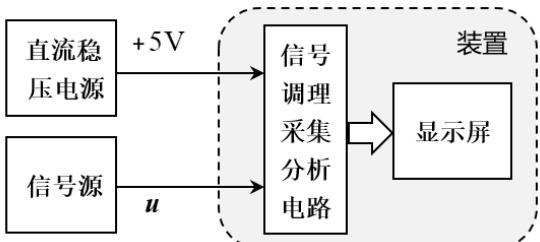

# 2026年全国大学生电子设计竞赛赛区赛(TI杯)暨模拟电子系统设计专题赛选拔赛赛题

参赛注意事项

（1）7 月 29 日 8:00 竞赛正式开始。每支参赛队可在赛区发布题目中任选一题，必须在竞赛第一天将竞赛选题上报赛区组委会。参赛队中有本科生成员即为本科参赛队，建议赛区对本科组参赛队和高职高专组参赛队分开评审及评奖。

（2）参赛队认真填写《登记表》内容，填写好的《登记表》交赛场巡视员暂时保存。

（3）参赛者必须是有正式学籍的全日制在校本科、高职高专学生，并出示能够证明参赛者学生身份的有效证件（如学生证）随时备查。

（4）每队严格限制3 人，开赛后不得中途更换队员。

（5）竞赛期间，可使用各种图书资料和网络资源，但不得在学校指定竞赛场地外进行设计制作，不得以任何方式与他人交流，包括教师在内的非参赛队员必须迴避，对违纪参赛队取消评审资格。

（6）8月1日20:00 竞赛结束，上交设计报告、制作实物及《登记表》，由专人封存。

## 周期信号测量分析装置（G 题）

## 一、任务

设计制作周期信号测量分析装置（以下简称为装置），可对信号源输出的周期信号u 进行测量与分析，信号源输出阻抗为 50Ω。装置既能在显示屏上稳定显示u 的波形图或电压频谱图，也能稳定显示u 的时域或频域相关参数值，频率分辨率 500Hz。装置组成框图如图1所示。

  
图 1 装置组成框图

## 二、要求

1. 装置输入 $u = u _ { \mathrm { a } }$ ，其电压峰峰值 $U _ { \mathrm { p p } } { = } 1 0 0 \mathrm { m V } { \sim } 2 5 0 \mathrm { m V }$ ，所有频率成分均在10kHz\~200kHz 范围内。下列四项要求在启动装置后，每一项完成时间不超过 2 秒。

（1）键控选择一屏显示 $u _ { \mathrm { a } }$ 的1个或者 3个完整周期波形。（6分）

（2）显示 $u _ { \mathrm { a } }$ 的电压峰峰值 $U _ { \mathfrak { p p } }$ 、有效值 $U _ { \mathrm { m s } }$ ，误差的绝对值均≤5mV；显示 $u _ { \mathrm { a } }$ 的基频值 $f _ { \mathrm { a l } }$ ，误差的绝对值≤1kHz。（13分）

（3）定性显示 $u _ { \mathrm { a } }$ 的电压频谱图。（5 分）

（4）显示 $u _ { \mathrm { a } }$ 的电压频谱各分量的幅值，误差的绝对值≤5mV。（9分）

2．装置输入 $u = u _ { \mathrm { b } }$ ，其电压峰峰值为 50mV\~250mV，所有频率成分均在

10kHz\~500kHz 范围内。下列四项要求在启动装置后，每一项完成时间不超过 2 秒。

（1）键控选择一屏显示 $u _ { \mathrm { b } }$ 的1个或者 3个完整周期波形。（6分）

（2）显示 $u _ { \mathrm { b } }$ 的电压峰峰值 $U _ { \mathfrak { p p } }$ 、有效值 $U _ { \mathrm { m s } }$ ，误差的绝对值均≤5mV；显示 $u _ { \mathrm { b } }$ 的基频值 $f _ { \mathrm { { b l } } }$ ，误差的绝对值≤1kHz。（13分）

（3）定性显示 $u _ { \mathrm { b } }$ 的电压频谱图。（5 分）

（4）显示 $u _ { \mathrm { b } }$ 的电压频谱各分量的幅值，误差的绝对值≤5mV。（9分）

3．装置输入 $u = u _ { \mathrm { b } } + u _ { \mathrm { J } }$ ，其中被测信号 $u _ { \mathrm { b } }$ 的电压峰峰值为 50mV\~250mV，所有频率成分均在 10kHz\~500kHz范围内；单频干扰 $u _ { \mathrm { J } }$ 的电压峰峰值为200mV、频率 $f _ { \mathrm { J } }$ ${ \geqslant } 1 \mathrm { M H z }$ 。要求装置能在抑制单频干扰 $u _ { \mathrm { J } }$ 影响的基础上，完成下列四项要求，在启动装置后，每一项完成时间不超过2秒。

（1）键控选择一屏显示 $u _ { \mathrm { b } }$ 的1个或者 3个完整周期波形。（6分）

（2）显示信号 $u _ { \mathrm { b } }$ 的电压峰峰值 $U _ { \mathrm { p p } }$ 、有效值 $U _ { \mathrm { m s } }$ ，误差的绝对值均≤5mV；显示$u _ { \mathrm { b } }$ 的基频值 $f _ { \mathrm { { b l } } }$ ，误差的绝对值≤1kHz。（15 分）

（3）定性显示 $u _ { \mathrm { b } }$ 的电压频谱图。（5 分）

（4）显示 $u _ { \mathrm { b } }$ 的电压频谱各分量的幅值，误差的绝对值≤5mV。（8分）

## 4．设计报告（20分）

## 三、说明

1. 装置测量与分析的信号 $u _ { \mathrm { a } }$ 或 $u _ { \mathrm { b } }$ 是由基波分量与1个或者2个谐波分量组合而成的周期信号。

2. 装置在时域测量分析状态下，测量显示的电压有效值应为“真有效值”。

3．装置在频域测量分析状态下，显示的 $u _ { \mathrm { a } }$ 或 $u _ { \mathrm { b } }$ 电压频谱应为在正频率轴上分布的频率分量。如信号源输出的由基波与其三次、四次谐波组合而成的周期信号表达式为 $u = U _ { \mathrm { 1 } } \sin \left( 2 \pi \times 1 0 . 5 \times 1 0 ^ { 3 } t \right) + U _ { \mathrm { 3 } } \sin \left( 2 \pi \times 3 1 . 5 \times 1 0 ^ { 3 } t \right) + U _ { \mathrm { 4 } } \sin \left( 2 \pi \times 4 2 . 0 \times 1 0 ^ { 3 } t \right) \left( \mathrm { m V } \times \mathrm { , } \mathrm { ~ m } \right)$ ）时，装置显示的电压频谱各分量的频率和幅值应为：

10.5 kHz，U mV 31.5 kHz，U3 mV 42.0kHz， $U _ { 4 }$ mV

4．定性显示电压频谱图：显示电压频谱图的坐标不一定加刻度，频谱图中正频率轴上离散谱线的根数、谱线频率相对位置、谱线长度之间的相对比例与装置输入信号 $u _ { \mathrm { a } }$ 或 $u _ { \mathrm { b } }$ 的电压频谱大体吻合即可。

5．装置采用单路5V直流稳压电源供电。

6. 装置的显示屏尺寸 $\geqslant 6$ 英寸。

7．本题信号源输出电缆阻抗 50Ω，电缆两端均为 BNC 接头（电缆应带至测试现场备用），参赛装置电路板上需焊接BNC 接头座，作为装置输入信号端口。信号源可使用具有“谐波发生器”功能的信号发生器，设置其输出信号u的基波与谐波分量幅度与频率值，各参数设置值作为相应参数测量的标称值。允许参赛队携带自用信号发生器参加作品测试。

## 四、评分标准

<table><tr><td></td><td>项目</td><td>主要内容</td><td>满分</td></tr><tr><td rowspan="6">设计报告</td><td>方案论证</td><td>比较与选择,方案描述。</td><td>3</td></tr><tr><td>理论分析与计算</td><td>系统相关参数设计</td><td>5</td></tr><tr><td>电路与程序设计</td><td>系统组成,原理框图与各部分电路图,系统软件与流程图。</td><td>5</td></tr><tr><td>测试方案与测试结果</td><td>测试结果完整性,测试结果分析。</td><td>5</td></tr><tr><td>设计报告结构及规范性</td><td>摘要,正文结构规范,图表的完整与准确性。</td><td>2</td></tr><tr><td colspan="2">合计</td><td>20</td></tr><tr><td rowspan="4">要求</td><td colspan="2">完成第1项</td><td>33</td></tr><tr><td colspan="2">完成第2项</td><td>33</td></tr><tr><td colspan="2">完成第3项</td><td>34</td></tr><tr><td colspan="2">合计</td><td>100</td></tr><tr><td colspan="3">总分</td><td>120</td></tr></table>