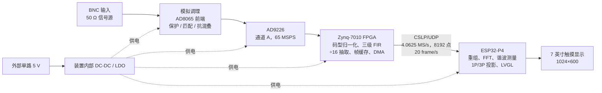
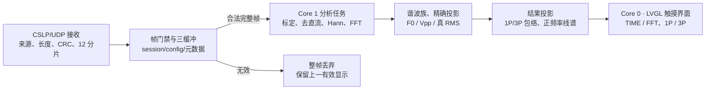

# CycleScope 周期信号测量分析装置设计报告

> 2026 年全国大学生电子设计竞赛赛区赛 · G 题

## 摘要

面向 G 题周期信号测量需求，设计了由模拟前端、AD9226、Zynq-7010、以太网和 ESP32-P4 组成的 CycleScope。AD9226 以 65 MSPS 采样；FPGA 三级 FIR 后 16 倍抽取；P4 对 8192 点帧完成 Hann 窗 FFT、谐波识别、真有效值和合成峰峰值计算，并在触摸屏显示 1/3 周期波形及正频率线谱。60 例联合验收的最大 F0、Vpp、真 RMS、谱线峰值误差为 0.180 Hz、3.727 mV、0.967 mV、1.082 mV；4～10 MHz 干扰的最小抑制下界为 65.997 dB。

**关键词：** 周期信号；谐波分析；Hann 窗；真有效值；FPGA；ESP32-P4

---

## 1. 任务分解与方案论证

被测对象为“基波 + 1 个或 2 个谐波”的纯交流周期信号。题设中的 $U_{pp}$ 指**合成波形总峰峰值**；频谱幅值按正弦分量的**峰值**（mVpk）表示。系统以持续采集、按键切换显示为工作方式，避免在测量期间调节模拟电路。

| 工况 | 输入边界 | 显示与测量要求 | 设计响应 |
|---|---|---|---|
| $u_a$ | 总 100～250 mVpp；全部分量 10～200 kHz | 键控 1P/3P；$U_{pp}$、真 RMS ≤5 mV；$f_0$ ≤1 kHz；正频率线谱及各分量幅值 ≤5 mV | 8192 点 FFT、相位重构、H1 相位锚定 |
| $u_b$ | 总 50～250 mVpp；全部分量 10～500 kHz | 同上，覆盖高阶谐波与弱基波 | 谐波族识别支持 H2～H16 实测覆盖 |
| $u_b+u_J$ | $u_b$ 同上；$u_J=200$ mVpp，$f_J\ge1$ MHz | 抑制干扰后完成同类波形、参数和线谱显示 | 模拟调理 + FPGA 抽取前低通 + P4 带内谐波判别 |

### 1.1 方案比较

| 方案 | 评价 | 结论 |
|---|---|---|
| P4 直接高速采样与 FFT | 难以承担 65 MSPS 采样接口，抗混叠与实时传输余量不足。 | 不采用 |
| FPGA 完成全部测量和 UI | 硬实时性好，但谐波算法、界面和调试迭代成本高。 | 不采用 |
| FPGA 采集/滤波，P4 分析/显示 | 将硬实时采集与可迭代算法分层，数据率与计算量均可控。 | **采用** |

选用单颗 AD9226 通道 A，避免双 ADC 交织的增益、偏置和相位失配。FPGA 先低通再 16 倍抽取，既抑制抽取折叠，又将板间净载荷降至约 2.62 Mbit/s。UDP 数据面采用“坏帧整帧丢弃 + 最新帧优先”，避免旧帧积压破坏显示实时性。7 英寸独立触摸屏支持 TIME/FFT 与 1P/3P 虚拟按键切换。

> **关键约束：** FFT 频点间隔须不大于 500 Hz；外部只允许一路 5 V 供电；现场以 50 Ω 信号源设置值为测量基准。高频干扰没有上限，不能把“软件忽略 500 kHz 以上频线”误当成抗混叠方案。

## 2. 系统与硬件设计



*图 1　CycleScope 整机原理框图*

### 2.1 模拟输入与采样前端

信号从 BNC 输入后进入 AD8065 同相前端。反馈网络取 $R_F=1.608\ \mathrm{k}\Omega$、$R_G=200.2\ \Omega$，理论闭环增益为：

$$
G_{fb}=1+R_F/R_G=9.032
$$

输出串联约 50 Ω 驱动 AD9226 的真实 50 Ω 负载时，理论加载增益为 4.516。真实电压比例由端到端校准身份 `calibration_id=25030` 管理，不将名义增益当作测量结果。

```text
BNC ── 输入调理 ── AD8065 同相前端 ── Rs≈50 Ω ── AD9226 输入（50 Ω）── FPGA
                       RF=1.608 kΩ
                       RG=200.2 Ω
```

模拟前端负责限制 ADC 采样前的带外能量；FPGA FIR 负责抽取前抗折叠。数字滤波不能修复已经在 ADC 前混叠进测量带的高频干扰。

### 2.2 FPGA 采集、滤波与传输

- AD9226 offset-binary 数据经 IOB 寄存器锁存并转换为零中心有符号量。
- 使用三级对称 Q1.17 FIR：`21 taps/÷4 → 31 taps/÷4 → 79 taps/÷1`，总抽取 16；群延迟 694 个 ADC tick 已补偿到帧时间戳语义。
- 双 Bank、AXI-Stream 与 100 MHz S2MM DMA 保证帧所有权；每帧为 `8192×S16_LE`，每 50 ms 投递一次。
- Zynq PS 以 CSLP/UDP 发送 12 个分片；CRC、UDP 校验和和帧元数据共同构成接收门禁。

## 3. 理论分析与关键计算

### 3.1 采样率、抽取与分辨率

原始采样率为 $f_{s0}=65\ \mathrm{MSPS}$。为使 8192 点 FFT 的频点间隔不超过 500 Hz，抽取倍数应满足：

$$
\frac{65\times10^6}{D\times8192}\le500
\quad\Rightarrow\quad D\ge15.869
$$

因此取 $D=16$。线上连续样点率和 FFT 栅格为：

$$
f_s=\frac{65\times10^6}{16}=4\,062\,500\ \mathrm{S/s}
$$

$$
\Delta f=\frac{f_s}{8192}=495.9106\ \mathrm{Hz}<500\ \mathrm{Hz}
$$

单帧采样窗口为 $8192/4\,062\,500=2.016492\ \mathrm{ms}$；10 kHz 基波在窗口内约含 20.16 个周期，500 kHz 分量仍有 8.125 点/周期，兼顾低频完整周期显示与高频谱线识别。

### 3.2 幅值标定与单边谱

按帧携带的比例和偏置将 ADC 码值换算至 BNC 输入端电压：

$$
x[n]=q[n]K_{LSB}+V_{off}
$$

分析时先去直流，再加 Hann 窗：

$$
w[n]=0.5\left(1-\cos\frac{2\pi n}{N-1}\right)
$$

对于非 DC、非 Nyquist 的频点，正频率单边峰值谱为：

$$
A[k]=\frac{2|X[k]|}{\sum_nw[n]}
$$

该归一化补偿 Hann 窗相干增益，避免把窗函数损失误报为谱线幅值误差。算法在 10～500 kHz 搜索局部峰值，对相邻三 Bin 作对数插值，并以整数倍关系选出“基波 + 1/2 谐波”族；随后在精确频率上直接正弦投影，支持谐波强于基波的情况。

### 3.3 真有效值、总峰峰值与完整周期波形

对已识别的正弦分量：

$$
u(t)=\sum_iA_i\sin(2\pi h_if_0t+\phi_i)
$$

题设各次谐波在一个基波周期内正交，因此按定义计算真有效值：

$$
U_{RMS}=\sqrt{\frac{1}{2}\sum_iA_i^2}
$$

总峰峰值不能用 $2\sum_iA_i$ 代替，因为相位会移动极值。程序保持每条谱线的幅相，在一个基波周期内重构 4096 个点，并取 $\max(\hat u)-\min(\hat u)$。时域显示以 H1 上升过零点作统一锚定；在同一帧内分别提取 1P 与 3P，并通过列内 min/max 包络保留窄峰。

频域页面只绘制通过谐波族校验的正频率离散谱线，避免把 Hann 主瓣和旁瓣画成“假谐波”。高频 $u_J$ 先由前端与 FPGA FIR 衰减，P4 仅对 10～500 kHz 的合法谐波族做投影。

## 4. 软件设计与人机交互

软件按“接收—分析—显示”分离。接收任务只处理网络和帧完整性；分析任务只处理最新完整帧；LVGL 任务只消费固定容量显示结果。该结构将短时绘图波动与实时收包隔离，避免 UI 阻塞导致数据堆积。



*图 2　接收、分析与显示解耦流程*

### 4.1 实时任务与容错

- Core 1 优先级 6 的 `cslp_udp_rx` 完成来源、会话、配置、CRC 与 12 分片检查。
- Core 1 优先级 4 的 `cs_analyze` 完成频谱、时域参数和投影；结果在发布前再次确认其仍为 current 帧。
- Core 0 独占 LVGL；PSRAM RGB565 画布只绘制已投影数据，显示队列深度为 1，采用 latest-wins。
- 无新有效测量 1000 ms 后进入 STALE；只有新有效帧可恢复 LIVE，避免旧数据被误显示为实时值。

### 4.2 显示与交互

- TIME 页面显示相位锚定后的 1P 或 3P 完整波形，并给出 $U_{pp}$、TRUE RMS、$f_0$。
- FFT 页面显示正频率离散线谱、各线频率和 mVpk；纵轴随可见谱线动态给出 mV/div。
- 触摸虚拟按键完成 TIME/FFT、1P/3P 切换；`TIME→FFT→TIME→1P→3P` 已完成两轮状态验证。
- 正式 FFT 固定使用经弱基波门禁验证的 `dsps_fft2r_fc32_ansi`；出现非法谱线或参数时不发布伪结果。

## 5. 测试方案与测试结果

测试采用分层取证：前端/FPGA 侧以 DG4202、示波器原始波形、LAN 帧和 pcap 共同验证；P4 侧以 FPGA 同步镜像帧、UART 测量结果和审计脚本交叉验证。所有定量结论均由归档原始数据复算，截图只用于形态与现场状态说明。

### 5.1 真实前端与 FPGA 数据链

| 测试项目 | 覆盖范围 | 结果 | 结论 |
|---|---|---|---|
| M11 历史动态范围与链路完整性 | 10/100/200/500 kHz × 10/50/100/250/450 mVpp；20 点、796 帧 | ADC、FIR、LAN、pcap、UDP checksum、分片与错误计数均通过；450 mV 点用于压缩风险观察，不属于当前 ≤250 mVpp 正式校准/验收范围。 | 历史证据 |
| 最终逐频校准独立保留集 | 36 个训练点后，15/75/150/250/350/425/485 kHz、100 mVpp 的7点 holdout | 最终 fit-v2 在不重拟合下通过；最大幅值/频率误差为 0.320542 mV / 234.985 Hz，生成 P4 profile C5DCDE41。 | PASS |
| 多音 $u_a/u_b$ | 10 点、650 帧；弱谱线与不同相位/波峰形状 | 最大谱线、总 Vpp、真 RMS 误差分别为 0.693/0.912/0.396 mV。 | PASS |
| $u_b+u_J$ 组合 | 15 点、975 帧；200 mVpp 单频干扰 | 最大谱线、总 Vpp、真 RMS 误差分别为 0.444/0.704/0.245 mV；最差干扰抑制下界 74.846 dB。 | PASS |
| 高频干扰扩展 | 4/5/7.2/7.5/10 MHz；7 点、287 帧 | 最差抑制下界 65.997 dB；最大谱线/总 Vpp/真 RMS 误差为 0.332/0.555/0.111 mV。 | PASS |
| 长时间运行 | 请求 10 000 帧，实收 10 001 帧/120 012 WAVE 包 | 首完整帧延迟 58.438 ms；10 个千帧块增益跨度 0.001908 dB；GEM、NIC、pcap 错误均为 0。 | PASS |

### 5.2 DG→FPGA/LAN→P4 全矩阵验收

| 覆盖组 | 例数 | 审计结果（共 60 份 P4 验收报告） |
|---|---:|---|
| H2～H16 谐波掩码；400 kHz 跨阶次 | 15 + 15 | 覆盖弱 H1、不同谐波阶次和高端频率；400 kHz 强谱线幅值极差仅 0.297 mV。 |
| H2/H3 相位 $4\times4$ | 16 | 谱线峰值最大跨相位漂移 0.095 mV；Vpp 随真实相位变化 96.388～126.139 mV，未被误判为幅值误差。 |
| $u_a/u_b$；H1/H3/H5 基准 | 7 + 1 | 覆盖低/高幅值、弱基波、H16 与高频端；每例至少保留 214 个源端 ON 的完整 FPGA 镜像帧。 |
| $u_b+u_J$ | 6 | 1/1.6/2 MHz、100 mVpk 干扰与无干扰基线成对测试；干扰不进入目标谱线。 |
| **最大绝对误差** | — | F0 0.180 Hz；Vpp 3.727 mV；真 RMS 0.967 mV；谱线频率 0.625 Hz；谱线峰值 1.082 mVpk。均低于题目 1 kHz / 5 mV 门限，审计 PASS。 |

相对于无干扰基线，加入 1/1.6/2 MHz、200 mVpp 单频干扰后，最大漂移为：F0 0.015 Hz、Vpp 0.096 mV、真 RMS 0.039 mV、谱线峰值 0.057 mVpk。

## 6. 误差、时限分析与结论

### 6.1 误差来源与抑制

| 来源 | 控制措施 |
|---|---|
| 前端增益、偏置与 ADC 量化 | 以 DG 50 Ω 设置值建立端到端标定；非零 `calibration_id` 与训练/保留集报告绑定。 |
| 非相干采样与谱泄漏 | Hann 窗、单边幅值归一化、三 Bin 插值和精确频率投影。 |
| 谐波相位导致的峰峰值变化 | 保持幅相重构求极差；H1 相位锚定后再提取完整 1P/3P。 |
| 高频干扰与抽取混叠 | 模拟调理限制 ADC 前带外能量；三级 FIR 在抽取前抑制带外；以 1～10 MHz 组合/上限点实测。 |
| UDP 丢包、坏帧和显示阻塞 | CRC、来源、会话、配置与 12 分片门禁；三缓冲 + latest-wins，坏帧不发布。 |

### 6.2 2 s 时限的软件预算

| 环节 | 已测结果 |
|---|---:|
| FPGA 启动推送至首完整帧 | 58.438 ms |
| 真实 FPGA 600 帧 P4 FFT | 平均/最大 16.923/24.219 ms |
| `TIME→FFT→TIME→1P→3P` 软件回调 | 最大 18.827 ms |
| 帧发布周期 | 50 ms（20 frame/s） |

上述数据说明数据链、分析与界面提交具有充分余量。题目计时从系统已启动且会话已建立后的按键开始；冷启动约 3.5～4.4 s 不计入该窗口。

### 6.3 结果边界与现场复核

> **证据口径：** 60 例为“DG 设置理论值→真实 FPGA/LAN 帧→P4 FFT/时域投影”的联合验收；前端/FPGA 测试补充了模拟前端、ADC、FIR 与高频干扰证据。二者共同支撑定量测量结论，但软件截图、UI 回调或数据链日志不能冒充为真实面板完成刷新的证据。

- **待现场人工留证：** 系统已经运行并持续分析时，TIME、FFT、1P、3P 按键至真实 panel flush 的时间；同时核对完整周期视觉稳定性、谱线相对位置/高度与可读性。
- **结构与供电留证：** 提交前拍摄板载 BNC、50 Ω 电缆、7 英寸独立显示屏与整机单路 5 V 供电照片/视频。开发板规格为 7 英寸 1024×600，满足尺寸选型要求。
- **频率与量程边界说明：** 已实测至 10 MHz 干扰；题设没有给出 $u_J$ 上限，因此不将该测试外推为任意高频下的 ADC 前抗混叠保证。100 kHz、450 mV 与 250 mV 相比的增益变化为 0.632%，仅保留为历史工程警示；当前正式标定/验收普通输入范围冻结为 ≤250 mVpp。

### 6.4 结论

CycleScope 以“模拟前端—高速采样—FPGA 实时抽取—P4 频域分析与触摸显示”的分层结构，实现了 495.91 Hz 频率栅格、完整 1P/3P 波形、正频率离散线谱、总 Vpp、真 RMS、基频和分量峰值的统一计算。归档测试显示：真实前端与 FPGA 链在动态范围、多音、干扰和 10 001 帧长稳下通过；最新 DG→FPGA/LAN→P4 的 60 例矩阵中各定量误差均低于题目门限。该方案具备完成 G 题核心测量分析任务的技术基础，最终交付时应按上述现场清单补齐显示物理刷新与整机结构供电证据。

## 证据与资料索引

- **E1：** `CycleScope-main/docs/G题_周期信号测量分析装置/full.md` 及主办方答疑。
- **E2：** `public/CSLP-G题采样与处理-Profile-v0.1.md`。
- **E3：** `CycleScope-FPGA/tool-of-rei/evidence/m11-real-frontend-20260731/`，包括校准、动态范围、多音、干扰和长稳证据。
- **E4：** `CycleScope-main/tool-of-rei/evidence/m12-final-completion-audit.json`，60 例 P4 联合审计，生成于 2026-08-01。
- **E5：** `CycleScope-main/tool-of-rei/项目快照.md`。

旧版 `CycleScope设计报告初稿.md` 标注为非最终提交，其中“未握手”的状态已被 E4 的后续证据覆盖。
